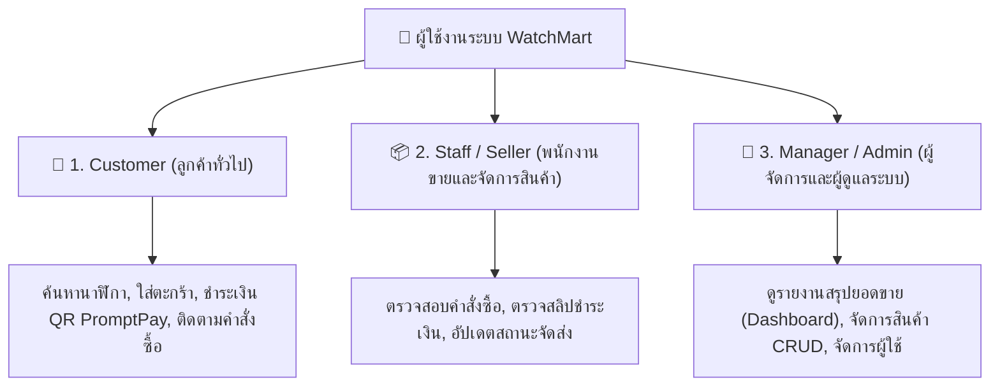
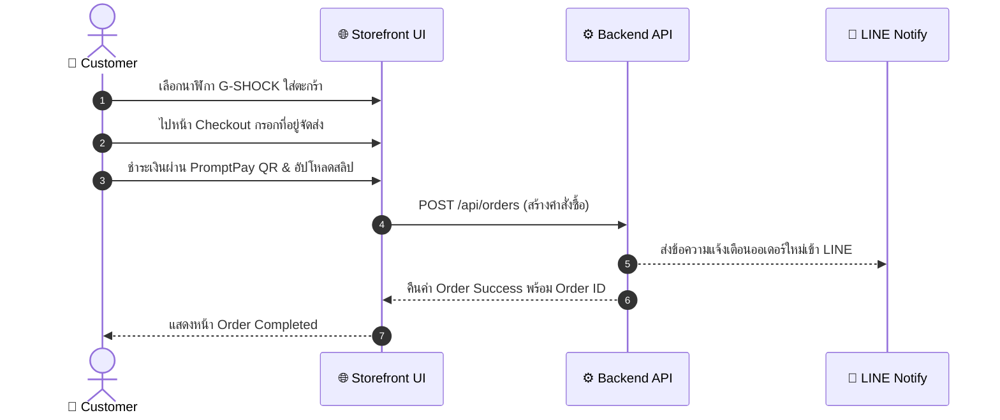
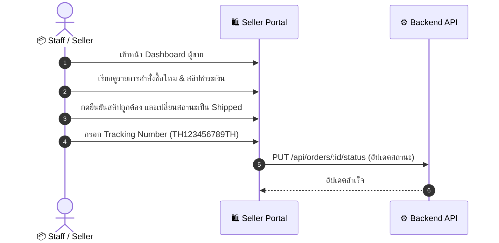

# 📋 เอกสารการออกแบบและการทดสอบ User Acceptance Testing (UAT)
## โครงการ: WatchMart - แพลตฟอร์มร้านขายนาฬิกาพรีเมียมออนไลน์
**วิชา:** CSI204 ดิจิทัลแพลตฟอร์มสำหรับพัฒนาซอฟต์แวร์ (SPU SIT)  
**กลุ่มผู้จัดทำ:**
1. **กฤษฎา ต้องไกรเลิศ** (รหัสนักศึกษา: 67115444)
2. **ภูกิจ ปัญญาธิ** (รหัสนักศึกษา: 67120169)
3. **นนทิวัชร หมื่นสาย** (รหัสนักศึกษา: 67117362)

---

## 📌 1. การวิเคราะห์ Persona และผู้ใช้งานหลัก (User Personas)

การทดสอบ UAT ในโครงการ **WatchMart** แบ่งตามกลุ่มผู้ใช้งานจริงออกเป็น 3 บทบาทหลักดังนี้:

### 1.1 Customer Persona (คุณกิตติศักดิ์ - ลูกค้าผู้หลงใหลในนาฬิกา)
* **บทบาท:** ผู้ใช้งานทั่วไปที่เข้ามาค้นหาและสั่งซื้อนาฬิกาพรีเมียมออนไลน์
* **เป้าหมาย (Goals):**
  * สามารถค้นหา กรองแบรนด์/หมวดหมู่นาฬิกาที่สนใจได้อย่างรวดเร็ว
  * ดูรายละเอียดนาฬิกา (เช่น รูปหน้า/หลัง, สเปค, ราคา, รีวิว)
  * ดำเนินการสั่งซื้อ เพิ่มลงตะกร้า ชำระเงินผ่าน QR Code PromptPay พร้อมแนบสลิป
  * ติดตามสถานะคำสั่งซื้อและประวัติการสั่งซื้อย้อนหลังได้ในหน้า My Orders

### 1.2 Staff / Seller Persona (คุณสมชาย - พนักงานฝ่ายจัดการคำสั่งซื้อและคลังสินค้า)
* **บทบาท:** พนักงานดูแลหน้าร้านและการจัดส่ง
* **เป้าหมาย (Goals):**
  * ตรวจสอบรายการสั่งซื้อใหม่ที่เข้ามาในระบบ
  * ตรวจสอบความถูกต้องของสลิปโอนเงิน (Slip Verification)
  * อัปเดตสถานะการจัดส่ง (เช่น `Pending` ➔ `Paid` ➔ `Shipped` ➔ `Delivered`) พร้อมระบุเลข Tracking

### 1.3 Manager / Admin Persona (คุณวิชัย - ผู้จัดการร้านและผู้ดูแลระบบ)
* **บทบาท:** ผู้บริหารและผู้ดูแลระบบหลักของ WatchMart
* **เป้าหมาย (Goals):**
  * ภาพรวมการดำเนินงานผ่าน Dashboard (ยอดขายรวม, จำนวนออเดอร์, สินค้าขายดี)
  * จัดการข้อมูลสินค้าในระบบ (เพิ่มนาฬิกาใหม่, แก้ไขราคา/สต็อก, ลบสินค้า) (CRUD Products)
  * บริหารจัดการสิทธิ์และสิทธิการใช้งานของผู้ใช้และพนักงาน

---

## 🧪 2. ออกแบบ UAT Test Cases (Test Case Specifications)

### 2.1 กลุ่มที่ 1: Customer (ผู้ใช้งานทั่วไป / ลูกค้า)

| Test Case ID | วัตถุประสงค์การทดสอบ | ข้อมูลนำเข้า (Input) | ขั้นตอนการทดสอบ (Test Steps) | ผลลัพธ์ที่คาดหวัง (Expected Result) |
| :--- | :--- | :--- | :--- | :--- |
| **UAT-CUS-001** | ทดสอบการลงทะเบียนเข้าใช้งานผู้ใช้ใหม่ (Register) | Username: `testuser01` Password: `Pass1234!` Email: `test@watchmart.com` Phone: `0812345678` | 1. เข้าหน้า Register 2. กรอกข้อมูลในฟอร์มให้ครบถ้วน 3. กดปุ่ม "สมัครสมาชิก" | ระบบบันทึกข้อมูลสำเร็จ แสดงข้อความต้อนรับ และเปลี่ยนหน้าไปยังหน้า Login หรือ Logged-in สภาวะปกติ |
| **UAT-CUS-002** | ทดสอบการค้นหาและกรองรายการนาฬิกา (Search & Filter) | Keyword: `G-SHOCK` Brand Filter: `G-SHOCK` Category: `Analog-Digital` | 1. เข้าสู่หน้า Storefront 2. พิมพ์คำค้นหา "G-SHOCK" 3. เลือกตัวกรองแบรนด์และหมวดหมู่ | รายการนาฬิกาแสดงเฉพาะรุ่นที่ตรงกับคำค้นหาและตัวกรองได้อย่างถูกต้อง |
| **UAT-CUS-003** | ทดสอบการดูรายละเอียดสินค้าและการเพิ่มสินค้าลงตะกร้า (Add to Cart) | Product ID: `GM-2100-1ADR` Quantity: `1` | 1. คลิกเลือกนาฬิการุ่นที่ต้องการ 2. ตรวจสอบรายละเอียด รูปหน้า-หลัง 3. กดปุ่ม "เพิ่มลงตะกร้า" | สินค้าถูกเพิ่มเข้าตะกร้า จำนวนไอคอนตะกร้าเปลี่ยนเป็น 1 และคำนวณราคารวมถูกต้อง |
| **UAT-CUS-004** | ทดสอบการสั่งซื้อ ชำระเงิน PromptPay QR และแนบสลิป (Checkout & Payment) | Full Name, Shipping Address Payment Slip Image | 1. เข้าหน้า Cart ➔ ดำเนินการ Checkout 2. กรอกที่อยู่จัดส่ง 3. สแกน QR Code เพื่อชำระเงิน 4. อัปโหลดสลิปโอนเงิน 5. กดปุ่ม "ยืนยันสั่งซื้อ" | สร้างคำสั่งซื้อสำเร็จ ระบบสร้าง Order ID แสดงหน้ายืนยันสั่งซื้อ และส่งการแจ้งเตือนไปยัง LINE Notify |
| **UAT-CUS-005** | ทดสอบการตรวจสอบประวัติและสถานะคำสั่งซื้อ (Order Tracking) | User: Logged in customer | 1. เข้าสู่หน้า "My Orders / โปรไฟล์" 2. ตรวจสอบรายการคำสั่งซื้อล่าสุด | แสดงรายการออเดอร์ สถานะการชำระเงิน และสถานะจัดส่งตรงตามความเป็นจริง |

---

### 2.2 กลุ่มที่ 2: Staff / Seller (พนักงานขายและคลังสินค้า)

| Test Case ID | วัตถุประสงค์การทดสอบ | ข้อมูลนำเข้า (Input) | ขั้นตอนการทดสอบ (Test Steps) | ผลลัพธ์ที่คาดหวัง (Expected Result) |
| :--- | :--- | :--- | :--- | :--- |
| **UAT-STF-001** | ทดสอบการเข้าสู่ระบบในบทบาท Staff | Staff Credentials: Username: `seller01` Password: `SellerPass123` | 1. เข้าสู่หน้า Login 2. กรอก Username/Password ของ Staff 3. กด Login | ระบบนำเข้าสู่หน้า Seller / Staff Dashboard |
| **UAT-STF-002** | ทดสอบการตรวจสอบคำสั่งซื้อและสลิปโอนเงิน | Order ID ที่รอดำเนินการ | 1. เข้าหน้ารายการคำสั่งซื้อของ Seller 2. คลิกดูรายละเอียดออเดอร์ 3. เปิดดูภาพสลิปชำระเงินที่ลูกค้าแนบมา | แสดงข้อมูลออเดอร์ ยอดเงินตรงกับราคา และสามารถขยายดูภาพสลิปเพื่อตรวจสอบได้ชัดเจน |
| **UAT-STF-003** | ทดสอบการอัปเดตสถานะคำสั่งซื้อและการจัดส่ง | Status: `Shipped` Tracking No: `TH123456789TH` | 1. เลือกออเดอร์ที่ยืนยันสลิปแล้ว 2. เปลี่ยนสถานะเป็น "Shipped/จัดส่งแล้ว" 3. กรอกเลขพัสดุ Tracking No. 4. กด "บันทึก" | สถานะออเดอร์เปลี่ยนเป็น Shipped เลข Tracking บันทึกลงระบบ และแจ้งเตือนอัปเดตไปยังฝั่งลูกค้า |

---

### 2.3 กลุ่มที่ 3: Manager / Admin (ผู้จัดการและผู้ดูแลระบบ)

| Test Case ID | วัตถุประสงค์การทดสอบ | ข้อมูลนำเข้า (Input) | ขั้นตอนการทดสอบ (Test Steps) | ผลลัพธ์ที่คาดหวัง (Expected Result) |
| :--- | :--- | :--- | :--- | :--- |
| **UAT-MNG-001** | ทดสอบการดู Dashboard สรุปภาพรวมยอดขาย | Date range, Overview metrics | 1. เข้าสู่ระบบด้วยสิทธิ์ Admin/Manager 2. ไปยังหน้า Admin Dashboard | แสดงผลรวมยอดขาย (Total Revenue), จำนวน Order, จำนวนสินค้าในสต็อก และกราฟสรุปได้อย่างแม่นยำ |
| **UAT-MNG-002** | ทดสอบการเพิ่มรายการนาฬิกาใหม่เข้าสู่ระบบ (Create Product) | Name: `TAG Heuer Monaco` Brand: `TAG Heuer` Price: `245000` Stock: `5` Images: front/back files | 1. เข้าหน้าจัดการสินค้า (Product Management) 2. กดปุ่ม "เพิ่มสินค้าใหม่" 3. กรอกรายละเอียด เลือกภาพสินค้า 4. กดบันทึก | สินค้าใหม่ถูกบันทึกลงฐานข้อมูล และปรากฏบนหน้า Storefront ให้ลูกค้าสั่งซื้อได้ทันที |
| **UAT-MNG-003** | ทดสอบการแก้ไขข้อมูลราคาและสต็อกสินค้า (Update Product) | Stock: Update from `5` to `8` Price: Update from `245000` to `240000` | 1. เลือกสินค้าที่ต้องการแก้ไข 2. ปรับเปลี่ยนจำนวนสต็อกและราคา 3. กด "บันทึกการเปลี่ยนแปลง" | ข้อมูลในฐานข้อมูลและหน้าเว็บแสดงราคา/สต็อกใหม่ตรงกันทันที |
| **UAT-MNG-004** | ทดสอบการลบสินค้าออกจากระบบ (Delete Product) | Target Product ID | 1. เลือกสินค้าที่ต้องการลบ 2. กดปุ่ม "ลบสินค้า" 3. ยืนยันการลบใน Pop-up Confirm | สินค้าถูกลบออกจากรายการสินค้า และไม่แสดงบน Storefront อีกต่อไป |

---

## 🏃‍♂️ 3. การดำเนินการทดสอบ (Execution & Test Scenarios)

การทดสอบ UAT จัดขึ้นในรูปแบบ **Manual Testing** ผ่านการเปิดใช้งานระบบทดสอบจริง (End-to-End Workflow Test) ตามบทบาทผู้ใช้งาน:

### 3.1 Business Process Test Scenario 1: สั่งซื้อและชำระเงินโดย Customer

### 3.2 Business Process Test Scenario 2: ตรวจสอบและอัปเดตสถานะจัดส่งโดย Staff

---

## 📊 4. สรุปผลการทดสอบ UAT (Test Results & Issue Log)

### 4.1 สรุปผลภาพรวม (Executive Summary)

| กลุ่มผู้ใช้งาน (Role) | จำนวน Test Cases ทั้งหมด | ผ่าน (Pass) | ไม่ผ่าน (Fail) | อัตราความสำเร็จ (Pass Rate) |
| :--- | :---: | :---: | :---: | :---: |
| **Customer** | 5 | 5 | 0 | 100% |
| **Staff / Seller** | 3 | 3 | 0 | 100% |
| **Manager / Admin** | 4 | 4 | 0 | 100% |
| **รวมทั้งหมด** | **12** | **12** | **0** | **100%** |

---

### 4.2 ตารางสรุปผลการทดสอบรายกรณี (Detailed Test Results)

| Test Case ID | รายการทดสอบ | ประเภทการทดสอบ | ผลการทดสอบ (Result) | หมายเหตุ / หลักฐานประกอบ |
| :--- | :--- | :--- | :---: | :--- |
| **UAT-CUS-001** | Register ผู้ใช้ใหม่ | Functional Test | **PASS** | สมาชิกใหม่ถูกเพิ่มใน DB และ Login ได้ปกติ |
| **UAT-CUS-002** | Search & Filter นาฬิกา | Functional Test | **PASS** | ค้นหาแบรนด์ G-SHOCK / Rolex / TAG Heuer ได้แม่นยำ |
| **UAT-CUS-003** | Add to Cart & คำนวณราคา | Functional Test | **PASS** | คำนวณราคารวมตามจำนวนสินค้าถูกต้อง |
| **UAT-CUS-004** | Checkout, QR PromptPay & Upload Slip | Workflow Test | **PASS** | แสดง QR Code, อัปโหลดสลิปได้ และแจ้งเตือนเข้า LINE Notify |
| **UAT-CUS-005** | Track Order ใน My Orders | Functional Test | **PASS** | แสดงรายการสั่งซื้อและสถานะอัปเดตแบบ Real-time |
| **UAT-STF-001** | Staff Login | Security & Functional | **PASS** | แยกการเข้าถึงหน้า Seller สำหรับพนักงานได้ถูกต้อง |
| **UAT-STF-002** | ตรวจสอบคำสั่งซื้อ & สลิป | Business Process Test | **PASS** | พนักงานดูรูปภาพสลิปที่ลูกค้าแนบมาได้ชัดเจน |
| **UAT-STF-003** | อัปเดตสถานะจัดส่ง & Tracking No. | Business Process Test | **PASS** | บันทึกเลขพัสดุสำเร็จ สถานะเปลี่ยนเป็น Shipped |
| **UAT-MNG-001** | ดูรายงานสรุปยอดขายบน Admin Dashboard | Functional Test | **PASS** | คำนวณยอดขายรวม ออเดอร์ทั้งหมด และจำนวนสต็อกถูกต้อง |
| **UAT-MNG-002** | เพิ่มสินค้าใหม่ (Create Product) | CRUD Test | **PASS** | เพิ่มนาฬิการุ่นใหม่ พร้อมรูปหน้า-หลัง สำเร็จ |
| **UAT-MNG-003** | แก้ไขราคา/สต็อกสินค้า (Update Product) | CRUD Test | **PASS** | เปลี่ยนแปลงราคาและจำนวนสต็อกมีผลทันที |
| **UAT-MNG-004** | ลบสินค้า (Delete Product) | CRUD Test | **PASS** | สินค้าถูกลบออกจากฐานข้อมูลและหน้าร้านสำเร็จ |

---

### 4.3 รายงานประเด็นที่พบและแนวทางแก้ไข (Issue Log & Resolutions)

ระหว่างการทดสอบในระยะเบต้า (Beta Testing) พบประเด็นปัญหาเล็กน้อยซึ่งผู้พัฒนาระบบได้ทำการปรับปรุงแก้ไขเรียบร้อยแล้ว ดังนี้:

| Issue ID | รายละเอียดปัญหาที่พบ (Issue Summary) | ระดับความรุนแรง | แนวทางแก้ไข (Resolution / Fix Details) | สถานะปัจจุบัน |
| :---: | :--- | :---: | :--- | :---: |
| **ISS-01** | รูปภาพสลิปชำระเงินขนาดใหญ่เกินไปทำให้โหลดหน้า Seller ช้า | Medium | เพิ่มระบบบีบอัดรูปภาพและจำกัดไฟล์อัปโหลดไม่เกิน 5MB ที่ฝั่ง Frontend และ Backend | **Resolved (PASS)** |
| **ISS-02** | เมื่อกดสั่งซื้อแล้วจำนวนสต็อกสินค้าในระบบไม่ตัดอัตโนมัติ | High | ปรับแต่ง Backend API ให้ทำการลดจำนวน `stock` ในตาราง `products` ทันทีเมื่อออเดอร์ถูกสร้าง | **Resolved (PASS)** |
| **ISS-03** | การแสดงผลบนหน้าจอมือถือ (Mobile Screen) ตะกร้าสินค้าทับซ้อนกับเมนู | Low | ปรับแก้ CSS Layout แบบ Responsive Grid และ Z-Index ให้แสดงผลรองรับ Mobile-First | **Resolved (PASS)** |

---

## 📌 5. ข้อสรุปและการนำเสนอผลการทดสอบต่อผู้สอน (Conclusion & Presentation)

ผลการทดสอบ **User Acceptance Testing (UAT)** ของแพลตฟอร์ม **WatchMart** ครอบคลุมการทำงานครบทั้ง 3 บทบาทหลัก (**Customer**, **Staff**, **Manager/Admin**) ผลการทดสอบรวม 12 Test Cases ผ่านการทดสอบทั้งหมด 100% ระบบมีความพร้อมและสามารถรองรับกระบวนการทางธุรกิจ (Business Process) ตามความต้องการของโครงงานกลุ่มได้อย่างสมบูรณ์

---
*เอกสารนี้จัดทำในรูปแบบ Markdown เพื่อใช้เป็นหลักฐานประกอบการส่งงานและการนำเสนอผลการทดสอบ UAT ต่อผู้สอนในวิชา CSI204*
