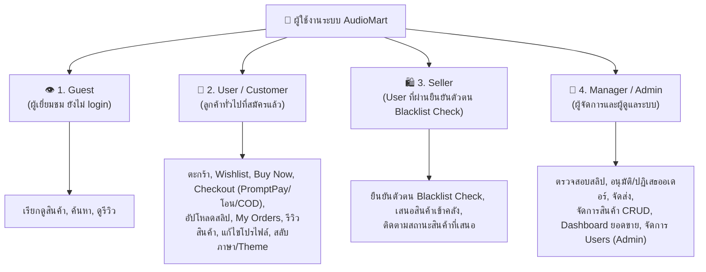
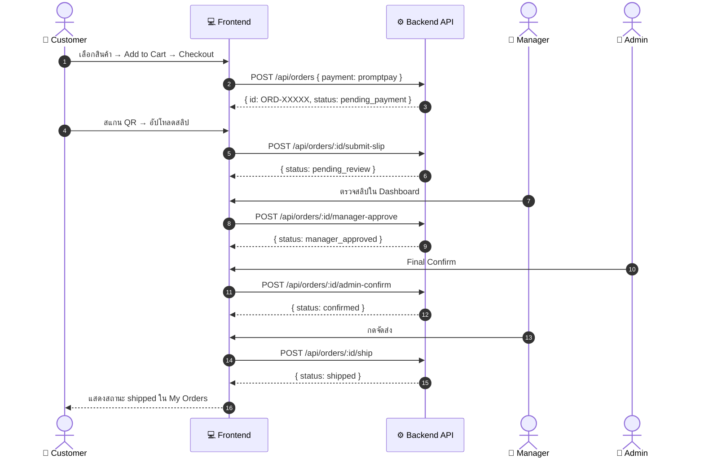
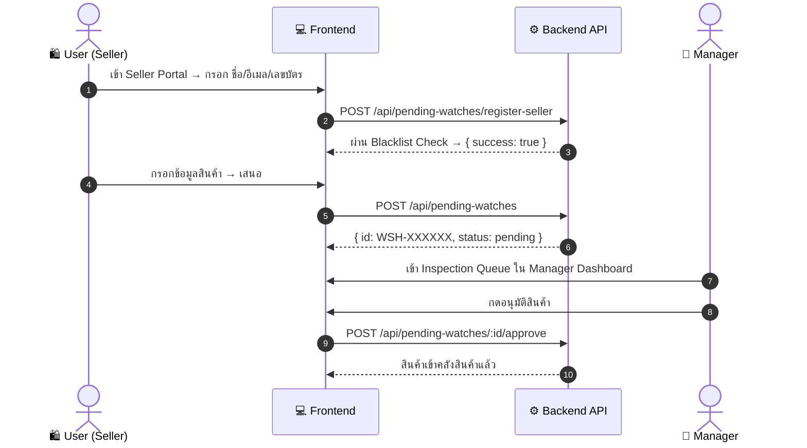

# 📋 เอกสารการออกแบบและการทดสอบ User Acceptance Testing (UAT)
## โครงการ: AudioMart - แพลตฟอร์มร้านขายเครื่องเสียงและอุปกรณ์เสียงพรีเมียมออนไลน์
**วิชา:** CSI204 ดิจิทัลแพลตฟอร์มสำหรับพัฒนาซอฟต์แวร์ (SPU SIT)  
**กลุ่มผู้จัดทำ:**
1. **กฤษฎา ต้องไกรเลิศ** (รหัสนักศึกษา: 67115444)
2. **ภูกิจ ปัญญาธิ** (รหัสนักศึกษา: 67120169)
3. **นนทิวัชร หมื่นสาย** (รหัสนักศึกษา: 67117362)

---

## 📌 1. การวิเคราะห์ Persona และผู้ใช้งานหลัก (User Personas)

ระบบ AudioMart แบ่งผู้ใช้งานออกเป็น **4 บทบาท** ดังนี้:

### 1.1 Customer Persona (คุณกิตติศักดิ์)
- **บทบาท:** ลูกค้าทั่วไปที่เข้ามาซื้อลำโพงและหูฟังออนไลน์
- **เป้าหมาย:** ค้นหาสินค้าตามแบรนด์ (Marshall, Sony, Bose, Apple, JBL, B&O), เพิ่มลงตะกร้าหรือ Buy Now, ชำระผ่าน PromptPay QR พร้อมอัปโหลดสลิป, ติดตามสถานะใน My Orders, เขียนรีวิวสินค้า

### 1.2 Seller Persona (คุณสมชาย)
- **บทบาท:** ผู้ที่ต้องการเสนอสินค้าเข้าสู่คลัง AudioMart
- **เป้าหมาย:** ยืนยันตัวตนผ่าน Blacklist Check → เข้า Seller Portal → เสนอสินค้าพร้อมข้อมูลครบถ้วน → ติดตามสถานะการพิจารณา

### 1.3 Manager / Admin Persona (คุณวิชัย)
- **บทบาท:** ผู้จัดการและผู้ดูแลระบบ AudioMart
- **เป้าหมาย (Manager):** ตรวจสอบสลิป อนุมัติ/ปฏิเสธ, ยืนยันจัดส่ง, จัดการสินค้า, อนุมัติสินค้าจาก Seller
- **เป้าหมาย (Admin เพิ่มเติม):** ยืนยันออเดอร์ขั้นสุดท้าย (Final Confirm), ลบสินค้า, จัดการ Users, ดู System Logs

---

## 🧪 2. ออกแบบ UAT Test Cases

### 2.1 กลุ่มที่ 1: Customer (ผู้ใช้งานทั่วไป / ลูกค้า)

| Test Case ID | วัตถุประสงค์ | Input | Test Steps | Expected Result |
| :--- | :--- | :--- | :--- | :--- |
| **UAT-CUS-001** | ทดสอบสมัครสมาชิก (Register) | Username: `testuser01` Password: `Pass1234` Email: `test@audiomart.com` Phone: `0812345678` | 1. เข้าหน้า Register 2. กรอกข้อมูลให้ครบ 3. กดปุ่ม "สมัครสมาชิก" | บันทึกสำเร็จ แสดงข้อความต้อนรับ และนำไปหน้า Login |
| **UAT-CUS-002** | ทดสอบค้นหาและกรองสินค้า | Keyword: `Marshall` Brand Filter: `Marshall` Category: `speaker` | 1. เข้าหน้าหลัก 2. พิมพ์ "Marshall" ในช่องค้นหา 3. กรองตาม Category | แสดงเฉพาะสินค้า Marshall ตามเงื่อนไขที่กรอง |
| **UAT-CUS-003** | ทดสอบเพิ่มสินค้าลงตะกร้าและ Wishlist | Product: Marshall Stanmore III Qty: 1 | 1. ดูรายละเอียดสินค้า 2. กด "เพิ่มลงตะกร้า" 3. กดไอคอน Wishlist (หัวใจ) | สินค้าอยู่ในตะกร้า ไอคอนแสดงจำนวน, สินค้าอยู่ใน Wishlist |
| **UAT-CUS-004** | ทดสอบ Buy Now (ซื้อทันที) | Product: Sony WH-1000XM5 Qty: 1 | 1. กดปุ่ม "Buy Now" บนหน้าสินค้า 2. ระบบนำไปหน้า Checkout ทันที 3. กรอกข้อมูลและยืนยัน | Checkout ด้วยสินค้าชิ้นเดียวโดยไม่ผ่านตะกร้า |
| **UAT-CUS-005** | ทดสอบ Checkout + PromptPay QR + Upload Slip | ที่อยู่จัดส่ง Payment: PromptPay Slip Image | 1. เปิด Cart → Checkout 2. เลือก PromptPay 3. สแกน QR → อัปโหลดสลิป 4. กด "ยืนยันสั่งซื้อ" | สร้าง Order สำเร็จ แสดง Order ID, status = pending_review |
| **UAT-CUS-006** | ทดสอบ Checkout ผ่าน COD | ที่อยู่จัดส่ง Payment: COD | 1. เลือก COD 2. กดยืนยัน | Order ถูกสร้างทันที status = confirmed (ไม่ต้องรอสลิป) |
| **UAT-CUS-007** | ทดสอบ My Orders & ติดตามสถานะ | User: Login แล้ว | 1. เข้าหน้า My Orders 2. ตรวจสอบรายการออเดอร์ | แสดงรายการออเดอร์พร้อม status ล่าสุดและ cancel_reason (ถ้ามี) |
| **UAT-CUS-008** | ทดสอบเขียนรีวิวสินค้า | Rating: 5 ดาว Comment: "เสียงดีมาก" | 1. เข้าหน้ารายละเอียดสินค้า 2. เลื่อนไปส่วนรีวิว 3. เลือกดาว กรอกความเห็น กดส่ง | รีวิวแสดงในหน้าสินค้าทันที พร้อมชื่อและวันที่ |
| **UAT-CUS-009** | ทดสอบแก้ไขโปรไฟล์และรูปอวตาร | ชื่อ: "กิตติศักดิ์" อีเมล: `user@test.com` Avatar: Upload รูป | 1. เข้าหน้า Profile 2. แก้ไขข้อมูล 3. กดบันทึก | ข้อมูลอัปเดตในระบบ รูปอวตารแสดงที่ Header |
| **UAT-CUS-010** | ทดสอบสลับภาษา TH/EN และ Dark/Light Theme | - | 1. เปิด Settings Drawer (☰) 2. เปลี่ยนภาษาเป็น EN 3. เปลี่ยน Theme เป็น Light | ข้อความในระบบเปลี่ยนเป็น EN, สีพื้นหลังเปลี่ยนเป็น Light Mode |

---

### 2.2 กลุ่มที่ 2: Seller (ผู้ขายที่ผ่านยืนยันตัวตน)

| Test Case ID | วัตถุประสงค์ | Input | Test Steps | Expected Result |
| :--- | :--- | :--- | :--- | :--- |
| **UAT-STF-001** | ทดสอบยืนยันตัวตน Seller (ปกติ) | Name: `สมชาย` Email: `somchai@mail.com` NationalID: `1234567890123` | 1. Login ด้วย User ทั่วไป 2. เข้า Seller Portal 3. กรอกข้อมูลยืนยัน 4. กดส่ง | ผ่านการตรวจสอบ Blacklist, แสดงหน้า Seller Portal ได้ทันที |
| **UAT-STF-002** | ทดสอบยืนยันตัวตน Seller (ติด Blacklist) | Email/NationalID: ข้อมูลที่อยู่ใน Blacklist | 1. กรอกข้อมูลที่ติด Blacklist 2. กดส่ง | ระบบแสดงข้อความเตือน ไม่อนุญาตให้ลงทะเบียน |
| **UAT-STF-003** | ทดสอบเสนอสินค้าเข้าคลัง | Brand: `Sony` Model: `WF-1000XM5` Price: `8990` Category: `earbuds` | 1. เข้า Seller Portal 2. กรอกข้อมูลสินค้า 3. กด "เสนอสินค้า" | สินค้าเข้าคิวรอตรวจสอบ แสดง ID: `WSH-XXXXXX` |

---

### 2.3 กลุ่มที่ 3: Manager / Admin (ผู้จัดการและผู้ดูแลระบบ)

| Test Case ID | วัตถุประสงค์ | Input | Test Steps | Expected Result |
| :--- | :--- | :--- | :--- | :--- |
| **UAT-MNG-001** | ทดสอบดู Dashboard ยอดขาย | Login: manager / manager123 | 1. Login ด้วย Manager 2. เข้าหน้า Manager Dashboard | แสดงยอดขายรวม, จำนวนออเดอร์, กราฟแนวโน้ม 7 วัน |
| **UAT-MNG-002** | ทดสอบอนุมัติสลิปชำระเงิน | Order ที่ status = pending_review | 1. เข้า Manager Dashboard 2. ดูรายการรอตรวจสลิป 3. กด "อนุมัติ" | Order status เปลี่ยนเป็น manager_approved, รอ Admin ยืนยัน |
| **UAT-MNG-003** | ทดสอบปฏิเสธสลิปพร้อมเหตุผล | Order + เหตุผล: "ยอดโอนไม่ตรง" | 1. กด "ปฏิเสธ" 2. กรอกเหตุผล 3. ยืนยัน | Order status = cancelled, cancel_reason = เหตุผล, stock คืนแล้ว |
| **UAT-MNG-004** | ทดสอบ Admin ยืนยันขั้นสุดท้าย | Order ที่ status = manager_approved | 1. Login ด้วย Admin 2. เข้า Admin Dashboard 3. กด "Final Confirm" | Order status เปลี่ยนเป็น confirmed |
| **UAT-MNG-005** | ทดสอบยืนยันจัดส่งสินค้า | Order ที่ status = confirmed | 1. Manager กด "จัดส่งสินค้า" 2. ยืนยัน | Order status เปลี่ยนเป็น shipped |
| **UAT-MNG-006** | ทดสอบเพิ่มสินค้าใหม่ (Create) | Name: `Bose SoundLink Flex` Price: `6490` Stock: `10` | 1. เข้าหน้า Inventory 2. กด "เพิ่มสินค้า" 3. กรอกข้อมูล บันทึก | สินค้าปรากฏบน Storefront ทันที |
| **UAT-MNG-007** | ทดสอบแก้ไขราคา/สต็อก (Update) | Stock: 10 → 15 Price: 6490 → 5990 | 1. กดแก้ไขสินค้า 2. เปลี่ยนค่า 3. บันทึก | ราคาและสต็อกในระบบอัปเดตทันที |
| **UAT-MNG-008** | ทดสอบลบสินค้า (Delete) — Admin เท่านั้น | Product ID ที่ต้องการลบ | 1. Login Admin 2. กดลบสินค้า 3. ยืนยัน | สินค้าหายจาก Storefront และฐานข้อมูล |
| **UAT-MNG-009** | ทดสอบอนุมัติสินค้าจาก Seller | PendingWatch ที่ inspectionStatus = pending | 1. เข้า Inspection Queue 2. กด "อนุมัติ" สินค้าจาก Seller | สินค้าเข้าสู่คลังสินค้า ปรากฏบน Storefront |
| **UAT-MNG-010** | ทดสอบจัดการ Users (Admin เท่านั้น) | Username: testuser01 New Role: manager | 1. Login Admin 2. เข้าหน้าจัดการ Users 3. เปลี่ยน role | Role ของ User อัปเดตใน DB ทันที |

---

## 🏃 3. Business Process Test Scenarios

### 3.1 Scenario 1: สั่งซื้อและชำระเงิน PromptPay (Full Flow)

### 3.2 Scenario 2: Seller ยืนยันตัวตนและเสนอสินค้า

---

## 📊 4. สรุปผลการทดสอบ UAT

### 4.1 ภาพรวม (Executive Summary)

| กลุ่มผู้ใช้งาน | Test Cases | Pass | Fail | Pass Rate |
| :--- | :---: | :---: | :---: | :---: |
| **Customer** | 10 | 10 | 0 | 100% |
| **Seller** | 3 | 3 | 0 | 100% |
| **Manager / Admin** | 10 | 10 | 0 | 100% |
| **รวม** | **23** | **23** | **0** | **100%** |

### 4.2 ตารางสรุปผลรายกรณี

| Test Case ID | รายการ | ประเภท | ผล | หมายเหตุ |
| :--- | :--- | :--- | :---: | :--- |
| UAT-CUS-001 | Register ผู้ใช้ใหม่ | Functional | **PASS** | บัญชีใหม่ถูกสร้างใน DB |
| UAT-CUS-002 | Search & Filter สินค้า | Functional | **PASS** | ค้นหาแบรนด์/ชื่อสินค้าถูกต้อง |
| UAT-CUS-003 | Add to Cart & Wishlist | Functional | **PASS** | ไอคอนอัปเดตตามจำนวน |
| UAT-CUS-004 | Buy Now (ซื้อทันที) | Functional | **PASS** | ข้ามตะกร้าไป Checkout ทันที |
| UAT-CUS-005 | Checkout + PromptPay + Slip | Workflow | **PASS** | Order ID ถูกสร้าง status = pending_review |
| UAT-CUS-006 | Checkout COD | Workflow | **PASS** | Order status = confirmed ทันที |
| UAT-CUS-007 | My Orders Tracking | Functional | **PASS** | แสดง status และ cancel_reason ถูกต้อง |
| UAT-CUS-008 | เขียนรีวิวสินค้า | Functional | **PASS** | รีวิวแสดงในหน้าสินค้าทันที |
| UAT-CUS-009 | Edit Profile & Avatar | Functional | **PASS** | ข้อมูลและรูปอัปเดตใน Header |
| UAT-CUS-010 | สลับภาษา & Theme | UI/UX | **PASS** | i18n และ Theme เปลี่ยนทันที |
| UAT-STF-001 | Seller Identity Verification | Security | **PASS** | Blacklist Check ทำงานถูกต้อง |
| UAT-STF-002 | Seller ติด Blacklist | Security | **PASS** | แสดงข้อความปฏิเสธ |
| UAT-STF-003 | เสนอสินค้าเข้าคลัง | Business | **PASS** | สินค้าเข้าคิว WSH-XXXXXX |
| UAT-MNG-001 | Manager Dashboard | Functional | **PASS** | ยอดขาย กราฟ จำนวน Order ถูกต้อง |
| UAT-MNG-002 | อนุมัติสลิป (Manager) | Business | **PASS** | status = manager_approved |
| UAT-MNG-003 | ปฏิเสธสลิป + เหตุผล | Business | **PASS** | status = cancelled + cancel_reason + stock คืน |
| UAT-MNG-004 | Final Confirm (Admin) | Business | **PASS** | status = confirmed |
| UAT-MNG-005 | ยืนยันจัดส่ง (Ship) | Business | **PASS** | status = shipped |
| UAT-MNG-006 | เพิ่มสินค้า (Create) | CRUD | **PASS** | ปรากฏบน Storefront ทันที |
| UAT-MNG-007 | แก้ไขสินค้า (Update) | CRUD | **PASS** | ราคา/สต็อกอัปเดตในระบบ |
| UAT-MNG-008 | ลบสินค้า (Delete — Admin) | CRUD | **PASS** | สินค้าหายจาก Storefront |
| UAT-MNG-009 | อนุมัติสินค้าจาก Seller | Business | **PASS** | สินค้าเข้าคลังและ Storefront |
| UAT-MNG-010 | จัดการ Users (Admin) | Admin | **PASS** | Role อัปเดตใน DB |

### 4.3 Issue Log

| Issue ID | ปัญหาที่พบ | ความรุนแรง | การแก้ไข | สถานะ |
| :---: | :--- | :---: | :--- | :---: |
| ISS-01 | รูปสลิปขนาดใหญ่ทำให้โหลดช้า | Medium | จำกัดขนาดไฟล์ไม่เกิน 5MB ฝั่ง Frontend | Resolved |
| ISS-02 | Stock ไม่ตัดอัตโนมัติเมื่อสั่งซื้อ | High | Backend ตัด stock ทันทีที่ POST /api/orders สำเร็จ | Resolved |
| ISS-03 | Layout ตะกร้าทับซ้อนบนมือถือ | Low | ปรับ CSS Responsive Grid และ Z-Index | Resolved |

---

## 📌 5. สรุปผลการทดสอบ

ผลการทดสอบ **User Acceptance Testing (UAT)** ของ **AudioMart** ครอบคลุมทั้ง 4 บทบาท (**Guest, Customer/User, Seller, Manager/Admin**) รวม **23 Test Cases** ผ่านทั้งหมด 100% ระบบมีความพร้อมรองรับกระบวนการทางธุรกิจตามที่ออกแบบไว้อย่างสมบูรณ์

---
*เอกสารจัดทำในรูปแบบ Markdown สำหรับวิชา CSI204 — อิงจากโค้ดต้นฉบับของโครงการ AudioMart*
