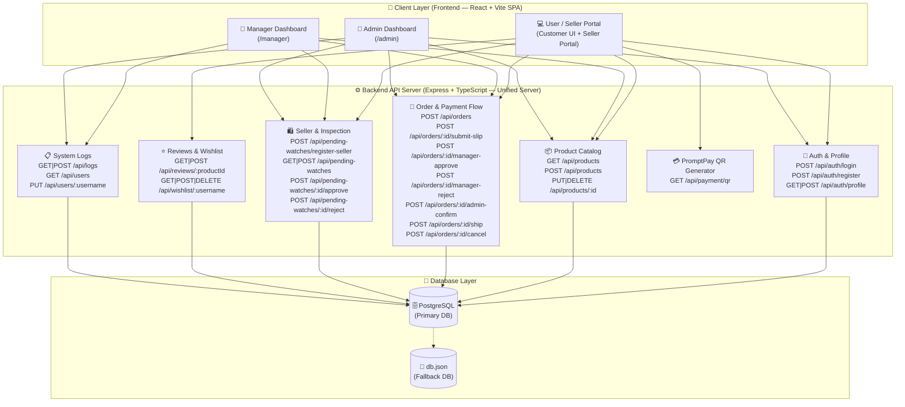
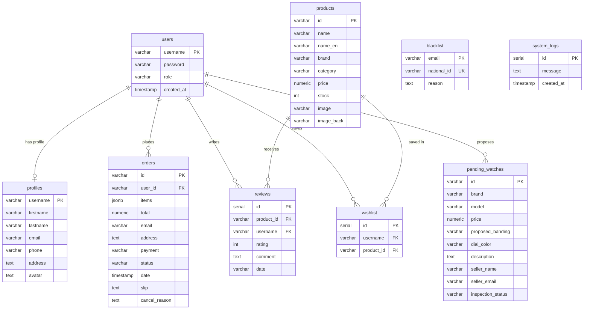
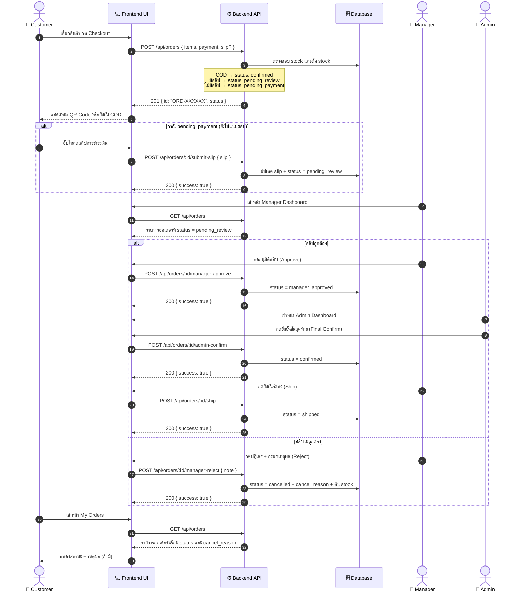
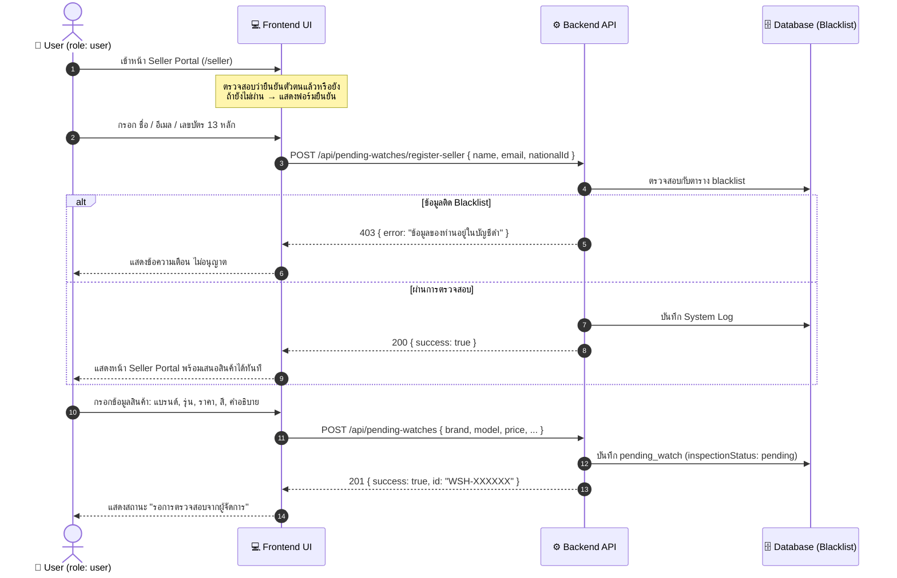
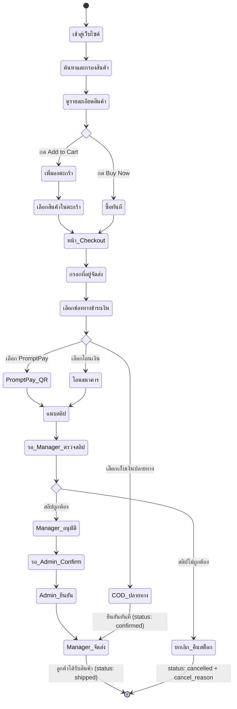
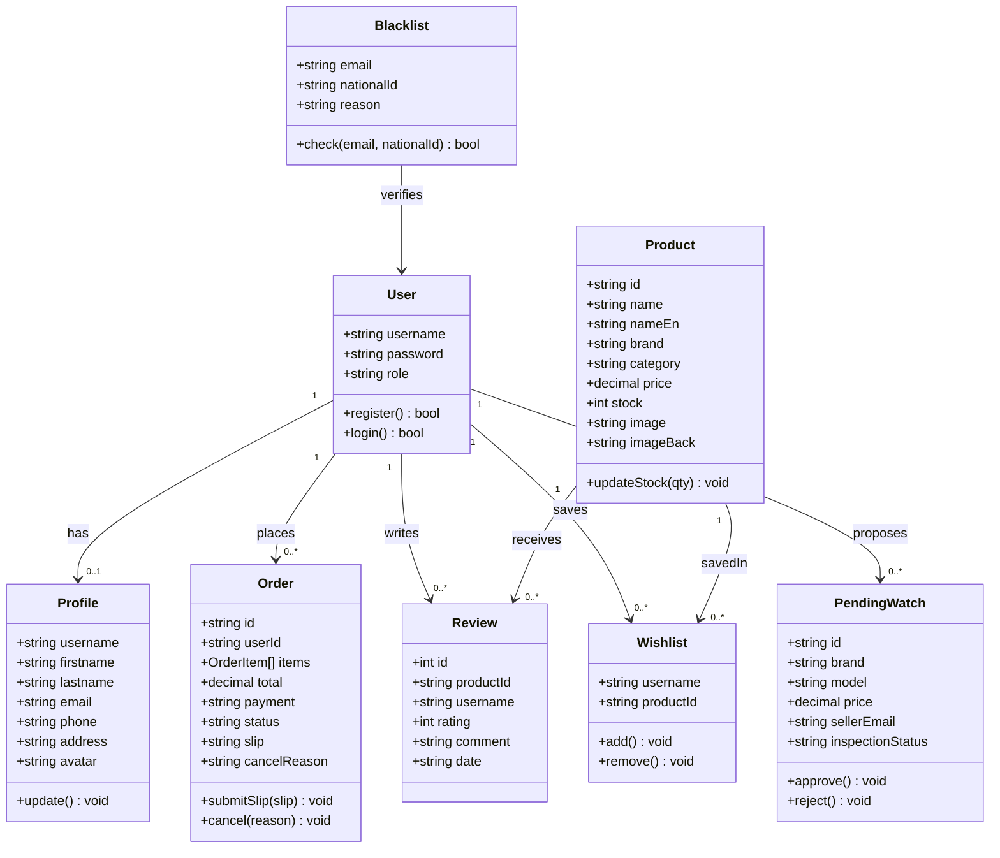

# 📄 เอกสารการวิเคราะห์และออกแบบระบบ (System Analysis & Design)
## โครงการ: AudioMart - แพลตฟอร์มร้านขายเครื่องเสียงและอุปกรณ์เสียงพรีเมียมออนไลน์
**วิชา: CSI204 ดิจิทัลแพลตฟอร์มสำหรับพัฒนาซอฟต์แวร์ (SPU SIT)**  
**ผู้จัดทำและการแบ่งงานตามประวัติ Git / SourceTree:**

| ชื่อ-นามสกุล | รหัสนักศึกษา | Git Account / Commit สายงาน | บทบาทและความรับผิดชอบหลัก (Contributions) |
| :--- | :--- | :--- | :--- |
| **1. กฤษฎา ต้องไกรเลิศ** | `67115444` | `sShinjikubs` | **Full-Stack Architect & Lead Developer** • ออกแบบ System Architecture, RESTful API & ฐานข้อมูล SQL/Fallback DB • พัฒนา Backend API (Auth, Orders, Products, Seller, Reviews, Wishlist) • จัดทำเอกสาร UAT Test Cases, เอกสารวิเคราะห์ระบบ และ DevOps Deploy บน Render |
| **2. ภูกิจ ปัญญาธิ** | `67120169` | `DESKTOP-H7BV0KF\PC` | **Backend Data & Inventory Specialist** • ออกแบบโครงสร้างแคตตาล็อกสินค้า (Product Seeds & Database Schema) • พัฒนาระบบคลังสินค้า (Inventory Management) และระบบรายการโปรด (Wishlist System) • ออกแบบโฟลว์การซื้อสินค้าแบบทันที (Buy Now Checkout) และจัดการไฟล์รูปภาพ |
| **3. นนทิวัชร หมื่นสาย** | `67117362` | `nxntiwxt` | **Frontend UI/UX & Localization Specialist** • ออกแบบและพัฒนาองค์ประกอบหน้าบ้าน (Frontend UI Components & Layout) • พัฒนาระบบการสลับสองภาษา (i18n System: TH / EN) และ Dark/Light Theme • พัฒนาระบบรีวิวสินค้า (Star Rating & Review System) และแก้ไขระบบค้นหาสินค้า |

---

## 1. การวิเคราะห์ความต้องการของระบบ (System Requirements)

### 1.1 ความต้องการเชิงฟังก์ชัน (Functional Requirements)

#### 👤 ระบบสำหรับผู้เยี่ยมชม (Guest — ยังไม่ได้ล็อกอิน)
- เรียกดูและค้นหาสินค้าเครื่องเสียงตามชื่อ แบรนด์ หรือหมวดหมู่
- กรองสินค้าตามประเภท (Speaker / Headphones / Earbuds) และช่วงราคา
- ดูรายละเอียดสินค้า สเปค รูปภาพ และรีวิวจากลูกค้า

#### 🛒 ระบบสำหรับลูกค้า (User — ผ่านการสมัครสมาชิก)
- ลงทะเบียนสมัครสมาชิกและเข้าสู่ระบบ (Register / Login)
- จัดการตะกร้าสินค้า: เพิ่ม / ลด / ลบสินค้า พร้อมเลือกรายการที่ต้องการชำระ
- จัดการรายการสินค้าที่ต้องการ (Wishlist) เพิ่ม/ลบได้
- ซื้อสินค้าทันที (Buy Now) โดยไม่ผ่านตะกร้า
- สั่งซื้อและชำระเงินผ่าน 3 ช่องทาง: PromptPay QR / โอนเงินธนาคาร / เก็บเงินปลายทาง (COD)
- แนบสลิปชำระเงิน (Upload Slip) สำหรับช่องทาง PromptPay และโอนธนาคาร
- ติดตามสถานะคำสั่งซื้อและดูประวัติทั้งหมดใน My Orders
- ยกเลิกคำสั่งซื้อที่ยังไม่ถูกยืนยัน พร้อมดูเหตุผลการปฏิเสธ (cancel_reason)
- เขียนรีวิวและให้คะแนนสินค้า (1-5 ดาว)
- แก้ไขข้อมูลโปรไฟล์ส่วนตัว (ชื่อ, ที่อยู่, อีเมล, เบอร์โทร, รูปอวตาร)
- สลับภาษาไทย / อังกฤษ และสลับ Dark / Light Theme

#### 🛍️ ระบบสำหรับผู้ขาย (Seller — User ที่ผ่านการยืนยันตัวตน)
- ยืนยันตัวตนด้วยชื่อ, อีเมล, และเลขบัตรประชาชน (13 หลัก) พร้อมตรวจสอบประวัติแบล็คลิสต์
- เมื่อผ่านการยืนยัน สามารถเข้าถึง Seller Portal เพื่อเสนอนำเข้าสินค้าใหม่สู่คลังสินค้า
- ติดตามสถานะการพิจารณาสินค้าที่เสนอ (pending / approved / rejected)

#### 👔 ระบบสำหรับผู้จัดการ (Manager)
- ดูภาพรวมยอดขายผ่าน Dashboard (ยอดรวม, จำนวนออเดอร์, กราฟแนวโน้ม 7 วัน)
- ตรวจสอบสลิปชำระเงิน: อนุมัติหรือปฏิเสธพร้อมระบุเหตุผล
- จัดการคลังสินค้า: เพิ่ม, แก้ไขราคา/สต็อก/รูปภาพสินค้า (CRUD)
- ตรวจสอบและอนุมัติ/ปฏิเสธสินค้าที่ Seller เสนอเข้า (Inspection Queue)
- ยืนยันการจัดส่งสินค้าหลังจาก Admin อนุมัติ

#### 👑 ระบบสำหรับผู้ดูแลระบบ (Admin)
- ทุกอย่างที่ Manager ทำได้
- ยืนยันขั้นสุดท้ายของออเดอร์ที่ Manager อนุมัติสลิปแล้ว (Admin Final Confirm)
- ลบสินค้าออกจากระบบ
- จัดการผู้ใช้: เปลี่ยน role และ reset รหัสผ่าน
- ดู System Logs การทำงานทั้งหมด
- เข้าถึงหน้าเอกสารระบบ (System Docs)

### 1.2 ความต้องการที่มิใช่เชิงฟังก์ชัน (Non-Functional Requirements)
- **Security**: ตรวจสอบสิทธิ์ด้วย Session-based Auth (localStorage + server validation)
- **Performance**: Backend ใช้ PostgreSQL พร้อม JSON Fallback เพื่อความเสถียรเมื่อ DB ไม่พร้อมใช้งาน
- **Scalability**: แยก Frontend (Vite/React SPA) และ Backend (Express/TypeScript REST API)
- **Responsiveness**: UI รองรับหน้าจอทุกขนาด (Mobile-First Responsive Design)
- **Bilingual**: รองรับภาษาไทยและอังกฤษ (i18n) และ Dark/Light Theme

---

## 2. การออกแบบสถาปัตยกรรมระบบ (System Architecture)

ระบบพัฒนาตามแนวคิด **Separation of Concerns** โดยแบ่งเป็น 2 ส่วนหลัก:
- **Frontend**: Single Page Application (SPA) พัฒนาด้วย React + Vite + Vanilla CSS
- **Backend**: RESTful API Server พัฒนาด้วย Node.js + Express + TypeScript

---

## 3. โครงสร้างฐานข้อมูล (Database Schema Design)

### 3.1 แผนภาพความสัมพันธ์ฐานข้อมูล (ER Diagram)

### 3.2 รายละเอียดโครงสร้างตาราง (Data Dictionary)

#### ตาราง `users`
| Column | Type | Description |
| :--- | :--- | :--- |
| `username` | VARCHAR(50) PK | ชื่อผู้ใช้สำหรับเข้าสู่ระบบ |
| `password` | VARCHAR(255) | รหัสผ่าน |
| `role` | VARCHAR(20) | สิทธิ์ผู้ใช้: `user` / `manager` / `admin` |

#### ตาราง `products`
| Column | Type | Description |
| :--- | :--- | :--- |
| `id` | VARCHAR PK | รหัสสินค้า เช่น `PROD-123456` |
| `name` | VARCHAR | ชื่อสินค้าภาษาไทย |
| `name_en` | VARCHAR | ชื่อสินค้าภาษาอังกฤษ |
| `brand` | VARCHAR | แบรนด์ (Marshall, Sony, Bose, Apple, JBL, B&O) |
| `category` | VARCHAR | หมวดหมู่: `speaker` / `headphones` / `earbuds` |
| `price` | NUMERIC | ราคาขาย (บาท) |
| `stock` | INT | จำนวนคงเหลือในคลัง |
| `image` | VARCHAR | URL รูปภาพหน้าสินค้า |
| `image_back` | VARCHAR | URL รูปภาพด้านหลังสินค้า |

#### ตาราง `orders` — Order Status ทั้งหมดในระบบ
| Status | ความหมาย | เปลี่ยนเมื่อ |
| :--- | :--- | :--- |
| `pending_payment` | รอลูกค้าแนบสลิป | สั่งซื้อแล้วแต่ยังไม่แนบสลิป |
| `pending_review` | รอ Manager ตรวจสลิป | ลูกค้าแนบสลิปแล้ว |
| `manager_approved` | Manager อนุมัติ รอ Admin | `POST /api/orders/:id/manager-approve` |
| `confirmed` | Admin ยืนยัน รอจัดส่ง | `POST /api/orders/:id/admin-confirm` หรือ COD |
| `shipped` | จัดส่งแล้ว | `POST /api/orders/:id/ship` |
| `cancelled` | ยกเลิก | ลูกค้ายกเลิก หรือ Manager ปฏิเสธสลิป |

---

## 4. การวิเคราะห์และออกแบบระบบด้วย UML Diagram

### 4.1 Use Case Diagram (ครอบคลุมทุก Role และทุก Feature)

```mermaid
graph TB
    GuestActor["👁️ Guest<br/>(ไม่ได้ล็อกอิน)"]
    UserActor["🛒 User<br/>(ลูกค้าทั่วไป)"]
    SellerActor["🛍️ Seller<br/>(User ที่ผ่านยืนยันตัวตน)"]
    ManagerActor["👔 Manager"]
    AdminActor["👑 Admin"]

    subgraph Public_Zone ["🌐 Public (ไม่ต้อง Login)"]
        UC_Browse["เรียกดูสินค้า (Browse)"]
        UC_Filter["ค้นหา & กรองสินค้า (Search & Filter)"]
        UC_ViewDetail["ดูรายละเอียดสินค้า & รีวิว"]
        UC_LoginReg["Login / Register"]
    end

    subgraph User_Zone ["🛒 User Features"]
        UC_Cart["จัดการตะกร้าสินค้า (Cart)"]
        UC_Wishlist["รายการโปรด (Wishlist)"]
        UC_BuyNow["ซื้อทันที (Buy Now)"]
        UC_Checkout["สั่งซื้อ: PromptPay / โอนธนาคาร / COD"]
        UC_UploadSlip["แนบสลิปชำระเงิน (Upload Slip)"]
        UC_TrackOrder["ติดตามสถานะออเดอร์ (My Orders)"]
        UC_CancelOrder["ยกเลิกคำสั่งซื้อ (Cancel Order)"]
        UC_Review["เขียนรีวิวสินค้า (Review & Rating)"]
        UC_Profile["แก้ไขโปรไฟล์ (Profile Edit)"]
        UC_UIPrefs["สลับภาษา TH/EN & Dark/Light Theme"]
    end

    subgraph Seller_Zone ["🛍️ Seller Portal (ผ่านยืนยันตัวตน)"]
        UC_VerifySeller["ยืนยันตัวตน & ตรวจ Blacklist"]
        UC_ProposeProduct["เสนอสินค้าเข้าคลัง (Propose Product)"]
        UC_TrackProposal["ติดตามสถานะสินค้าที่เสนอ"]
    end

    subgraph Manager_Zone ["👔 Manager Dashboard"]
        UC_Dashboard["ดูยอดขาย Dashboard & กราฟ 7 วัน"]
        UC_ReviewSlip["ตรวจสอบสลิป: อนุมัติ / ปฏิเสธ + เหตุผล"]
        UC_ShipOrder["ยืนยันจัดส่งสินค้า (Ship)"]
        UC_ManageProduct["จัดการสินค้า: เพิ่ม / แก้ไขสต็อก-ราคา"]
        UC_InspectProduct["ตรวจสอบ & อนุมัติสินค้าจาก Seller"]
        UC_ViewLogs["ดู System Activity Logs"]
    end

    subgraph Admin_Zone ["👑 Admin Only"]
        UC_AdminConfirm["ยืนยันออเดอร์ขั้นสุดท้าย (Final Confirm)"]
        UC_DeleteProduct["ลบสินค้าออกจากระบบ"]
        UC_ManageUsers["จัดการ Users: เปลี่ยน Role / Reset Password"]
        UC_ViewDocs["เข้าถึงเอกสารระบบ (System Docs)"]
    end

    GuestActor --> UC_Browse
    GuestActor --> UC_Filter
    GuestActor --> UC_ViewDetail
    GuestActor --> UC_LoginReg

    UserActor --> UC_Browse
    UserActor --> UC_Filter
    UserActor --> UC_ViewDetail
    UserActor --> UC_Cart
    UserActor --> UC_Wishlist
    UserActor --> UC_BuyNow
    UserActor --> UC_Checkout
    UserActor --> UC_UploadSlip
    UserActor --> UC_TrackOrder
    UserActor --> UC_CancelOrder
    UserActor --> UC_Review
    UserActor --> UC_Profile
    UserActor --> UC_UIPrefs
    UserActor --> UC_VerifySeller

    SellerActor --> UC_Browse
    SellerActor --> UC_Cart
    SellerActor --> UC_Wishlist
    SellerActor --> UC_Checkout
    SellerActor --> UC_Review
    SellerActor --> UC_Profile
    SellerActor --> UC_VerifySeller
    SellerActor --> UC_ProposeProduct
    SellerActor --> UC_TrackProposal

    ManagerActor --> UC_Dashboard
    ManagerActor --> UC_ReviewSlip
    ManagerActor --> UC_ShipOrder
    ManagerActor --> UC_ManageProduct
    ManagerActor --> UC_InspectProduct
    ManagerActor --> UC_ViewLogs

    AdminActor --> UC_Dashboard
    AdminActor --> UC_ReviewSlip
    AdminActor --> UC_ShipOrder
    AdminActor --> UC_ManageProduct
    AdminActor --> UC_InspectProduct
    AdminActor --> UC_ViewLogs
    AdminActor --> UC_AdminConfirm
    AdminActor --> UC_DeleteProduct
    AdminActor --> UC_ManageUsers
    AdminActor --> UC_ViewDocs

    UC_Checkout -.-> UC_LoginReg
    UC_ProposeProduct -.-> UC_VerifySeller
    UC_ReviewSlip -.-> UC_AdminConfirm
    UC_AdminConfirm -.-> UC_ShipOrder
```

---

### 4.2 Sequence Diagram — โฟลว์การสั่งซื้อและอนุมัติออเดอร์ (ตาม API จริง)

---

### 4.3 Sequence Diagram — โฟลว์การยืนยันตัวตน Seller

---

### 4.4 Activity Diagram — โฟลว์การสั่งซื้อสินค้าฉบับสมบูรณ์

---

### 4.5 Class Diagram (โครงสร้างข้อมูลหลัก)

---

## 5. การออกแบบส่วนติดต่อผู้ใช้งาน (UI/UX Design)

### 5.1 แนวคิดการออกแบบ
- **Color Palette**: Dark Slate `#0f172a` / Deep Midnight `#0b0c10` ตัดกับ Gold `#c5a880`
- **Typography**: Outfit (Google Fonts) — ทันสมัย อ่านง่าย
- **Visual Style**: Glassmorphism Cards + Backdrop Blur Effects
- **Animation**: Micro-animations และ Smooth Transitions

### 5.2 โครงสร้างหน้าเว็บในระบบ (Page Structure & Role Access)

| หน้า | Route | Role ที่เข้าได้ |
| :--- | :--- | :--- |
| หน้าแรก (Storefront) | `/` | ทุกคน |
| รายละเอียดสินค้า | `/product/:id` | ทุกคน |
| เข้าสู่ระบบ | `/login` | Guest เท่านั้น |
| สมัครสมาชิก | `/register` | Guest เท่านั้น |
| โปรไฟล์ | `/profile` | user, manager, admin |
| ชำระเงิน | `/checkout` | user, manager, admin |
| ประวัติออเดอร์ | `/my-orders` | user, manager, admin |
| Seller Portal | `/seller` | user (ผ่านยืนยัน), manager, admin |
| Manager Dashboard | `/manager` | manager, admin |
| Admin Dashboard | `/admin` | admin |
| เอกสารระบบ | `/docs` | admin |

---

*เอกสารนี้จัดทำโดยอิงจากโค้ดต้นฉบับของโครงการ AudioMart สำหรับวิชา CSI204*
