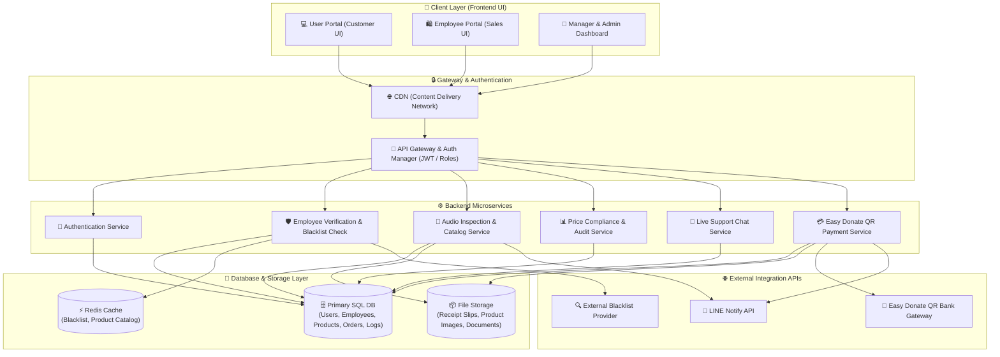
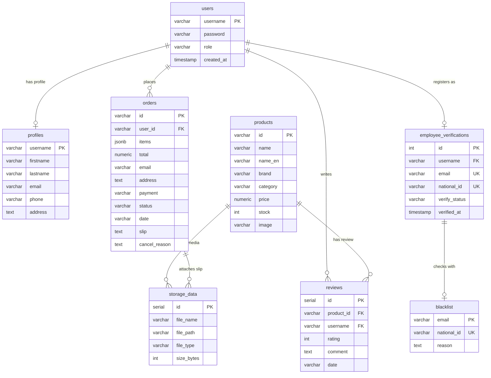
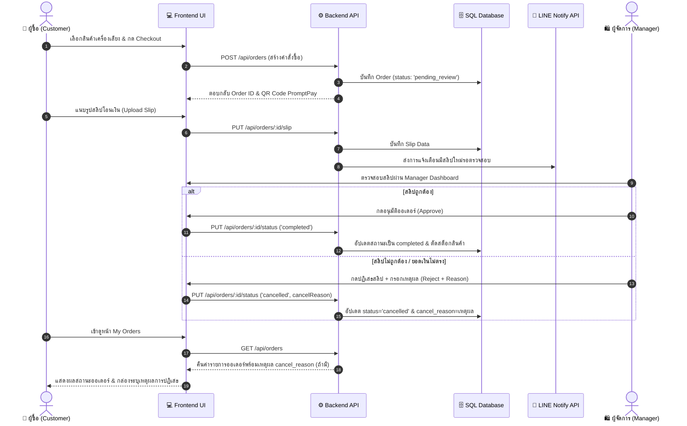

# 📄 เอกสารการวิเคราะห์และออกแบบระบบ (System Analysis & Design)
## โครงการ: AudioMart - แพลตฟอร์มร้านขายเครื่องเสียงและอุปกรณ์เสียงพรีเมียมออนไลน์
**วิชา: CSI204 ดิจิทัลแพลตฟอร์มสำหรับพัฒนาซอฟต์แวร์ (SPU SIT)**  
**ผู้จัดทำ:**
1. **กฤษฎา ต้องไกรเลิศ** (รหัสนักศึกษา: 67115444)
2. **ภูกิจ ปัญญาธิ** (รหัสนักศึกษา: 67120169)
3. **นนทิวัชร หมื่นสาย** (รหัสนักศึกษา : 67117362)

---

## 1. การวิเคราะห์ความต้องการของระบบ (System Requirements)
แพลตฟอร์ม **AudioMart** พัฒนาขึ้นเพื่อรองรับพฤติกรรมการซื้อเครื่องเสียง ลำโพง และหูฟังพรีเมียมผ่านทางออนไลน์ โดยแบ่งความต้องการออกเป็น 2 ส่วนหลัก:

### 1.1 ความต้องการเชิงฟังก์ชัน (Functional Requirements)
- **ระบบสำหรับผู้ซื้อทั่วไป (Customer Front-end)**:
  - ลงทะเบียนและเข้าสู่ระบบ (Register / Login)
  - เลือกชมและค้นหาลำโพง/หูฟังตามประเภท แบรนด์ (Marshall, Sony, Bose, Apple, JBL, B&O) หรือช่วงราคา (Product Browsing & Filtering)
  - ระบบตะกร้าสินค้า (Shopping Cart) เพิ่ม/ลดจำนวนสินค้า
  - สั่งซื้อสินค้าและชำระเงินผ่าน PromptPay QR Code (Easy Donate API) หรือโอนเงินผ่านธนาคาร
  - แนบสลิปชำระเงิน และติดตามสถานะคำสั่งซื้อพร้อมดูเหตุผลการยกเลิก/ปฏิเสธรายการ (`cancel_reason`)
- **ระบบสำหรับพนักงานขาย (Employee / Sales Portal)**:
  - ลงทะเบียนยืนยันตัวตนพนักงานด้วยเลขบัตรประชาชน (13 หลัก) และอีเมลองค์กร
  - ตรวจสอบประวัติความปลอดภัยผ่านระบบแบล็คลิสต์ (Blacklist Verification System)
  - เสนอนำเข้าสินค้าเครื่องเสียงใหม่สู่คลังสินค้าเพื่อรอผู้จัดการตรวจสอบ (Add Audio Product to Stock)
- **ระบบสำหรับผู้จัดการและผู้ดูแลระบบ (Manager & Admin Dashboard)**:
  - ตรวจสอบคุณภาพสินค้า (Inspection Queue) และอนุมัตินำเข้าสินค้าขึ้นหน้าร้าน
  - จัดการข้อมูลคลังสินค้าและราคาสินค้า (CRUD Inventory Management)
  - ตรวจสอบสลิปชำระเงิน อนุมัติออเดอร์ หรือปฏิเสธพร้อมระบุเหตุผล (Order & Slip Management)
  - ตรวจสอบราคากลางและความถูกต้อง (Price Compliance Audit)
  - ระบบแชทช่วยเหลือลูกค้าสด (Live Support Chat Simulation)
- **ระบบแจ้งเตือนภายนอก (Integration Notification)**:
  - แจ้งเตือนยอดคำสั่งซื้อและการชำระเงินผ่าน LINE Notify API

### 1.2 ความต้องการที่มิใช่เชิงฟังก์ชัน (Non-Functional Requirements)
- **Security**: การรักษาความปลอดภัยข้อมูลผู้ใช้ รหัสผ่านถูกแฮชก่อนบันทึก และใช้ Token-based Authentication (JWT)
- **Performance**: โหลดหน้าเว็บได้รวดเร็ว (ต่ำกว่า 2 วินาที) โดยมีระบบ Cache สำหรับข้อมูลรายการสินค้าที่เข้าถึงบ่อย
- **Scalability**: สถาปัตยกรรมแยกส่วน (Microservices) รองรับการขยายตัวเมื่อมีผู้ใช้งานพร้อมกันจำนวนมาก
- **Responsiveness**: หน้าเว็บแสดงผลได้ดีทั้งบนหน้าจอคอมพิวเตอร์ แท็บเล็ต และมือถือ (Mobile-First Design)

---

## 2. การออกแบบสถาปัตยกรรมระบบ (System Architecture)
ระบบถูกออกแบบตามหลักการ **Separation of Concerns (SoC)** และสถาปัตยกรรม **Microservices** เพื่อการพัฒนาที่ยืดหยุ่น

### 2.1 แผนผังสถาปัตยกรรมระบบ (Mermaid Diagram)

---

## 3. การออกแบบตามหลักการวิศวกรรมซอฟต์แวร์ (Software Engineering Principles)

### 3.1 Separation of Concerns (SoC) & Modularity
- **Frontend Layer**: จัดการการแสดงผล UI และ User Interaction ด้วย React + Vanilla CSS
- **Backend Layer**: แยกฟังก์ชันเป็น Microservices อิสระผ่าน RESTful APIs

### 3.2 Single Responsibility Principle (SRP)
- `Auth Service`: ทำหน้าที่ยืนยันตัวตนผู้ใช้
- `Product Service`: จัดการคลังและรายการสินค้าเครื่องเสียง
- `Order Service`: จัดการตะกร้า คำสั่งซื้อ และเหตุผลการปฏิเสธรายการ

### 3.3 Loose Coupling & Performance Optimization
- สื่อสารระหว่างบริการด้วยมาตรฐาน JSON ผ่าน RESTful API
- ใช้ **Redis Cache** สำหรับข้อมูลสินค้าที่ถูกเรียกดูบ่อย เพื่อลดภาระการ Query ของฐานข้อมูลหลัก

---

## 4. โครงสร้างฐานข้อมูล (Database Schema Design)

### 4.1 แผนภาพความสัมพันธ์ฐานข้อมูลฉบับสมบูรณ์ (Unified ER Diagram)

### 4.2 รายละเอียดโครงสร้างตาราง (Data Dictionary)

#### 1. ตาราง `users`
| Column Name | Data Type | Constraints | Description |
| :--- | :--- | :--- | :--- |
| `username` | VARCHAR(50) | PRIMARY KEY | ชื่อผู้ใช้สำหรับเข้าสู่ระบบ |
| `password` | VARCHAR(255) | NOT NULL | รหัสผ่านที่ผ่านการ Hashing |
| `role` | VARCHAR(20) | NOT NULL | สิทธิ์ผู้ใช้ (`user`, `manager`, `admin`) |

#### 2. ตาราง `products`
| Column Name | Data Type | Constraints | Description |
| :--- | :--- | :--- | :--- |
| `id` | VARCHAR(50) | PRIMARY KEY | รหัสสินค้าเครื่องเสียง |
| `name` | VARCHAR(100) | NOT NULL | ชื่อสินค้าภาษาไทย |
| `name_en` | VARCHAR(100) | | ชื่อสินค้าภาษาอังกฤษ |
| `brand` | VARCHAR(50) | NOT NULL | แบรนด์ (Marshall, Sony, Bose, ฯลฯ) |
| `category` | VARCHAR(50) | NOT NULL | หมวดหมู่ (`speaker`, `headphones`, `earbuds`) |
| `price` | NUMERIC(12,2) | NOT NULL | ราคาขาย (บาท) |
| `stock` | INT | DEFAULT 0 | จำนวนสินค้าคงเหลือในคลัง |
| `image` | VARCHAR(255) | | ที่อยู่ไฟล์รูปภาพสินค้า |

#### 3. ตาราง `orders`
| Column Name | Data Type | Constraints | Description |
| :--- | :--- | :--- | :--- |
| `id` | VARCHAR(50) | PRIMARY KEY | รหัสใบสั่งซื้อ (เช่น `ORD-123456`) |
| `user_id` | VARCHAR(50) | FOREIGN KEY | รหัสผู้สั่งซื้อ |
| `items` | JSONB | NOT NULL | รายการสินค้าและจำนวนในออเดอร์ |
| `total` | NUMERIC(12,2) | NOT NULL | ราคารวมทั้งสิ้น |
| `payment` | VARCHAR(50) | NOT NULL | ช่องทางชำระเงิน (PromptPay, Bank Transfer) |
| `status` | VARCHAR(20) | NOT NULL | สถานะ (`pending_review`, `completed`, `cancelled`) |
| `slip` | TEXT | | รูปภาพสลิปโอนเงิน Base64/URL |
| `cancel_reason` | TEXT | | เหตุผลการยกเลิก/ปฏิเสธสลิปโดยผู้จัดการ |

---

## 5. การวิเคราะห์และออกแบบระบบด้วย UML Diagram (UML Design)

### 5.1 Use Case Diagram (แผนภาพแสดงการทำงานของผู้ใช้)

```mermaid
graph TB
    UserActor["👤 ผู้ซื้อ (Customer)"]
    EmployeeActor["🛍️ พนักงานขาย (Employee)"]
    AdminActor["👑 ผู้ดูแลระบบ/ผู้จัดการ (Admin & Manager)"]

    subgraph AudioMart_System ["💼 ระบบ AudioMart Platform"]
        UC_Login["เข้าสู่ระบบ (Login)"]

        subgraph Customer_Actions ["🛒 Customer Use Cases"]
            UC_Search["ค้นหาและกรองเครื่องเสียง (Search & Filter)"]
            UC_Cart["จัดการตะกร้าสินค้า (Manage Cart)"]
            UC_Checkout["สั่งซื้อสินค้า PromptPay/โอนเงิน (Checkout)"]
            UC_UploadSlip["แนบสลิปชำระเงิน (Upload Slip)"]
            UC_Track["ติดตามสถานะ & ดูเหตุผลยกเลิก (Track Orders)"]
        end

        subgraph Employee_Actions ["🛍️ Employee Use Cases"]
            UC_Verify["ยืนยันตัวตนพนักงาน & ตรวจ Blacklist (Employee Verify)"]
            UC_AddAudio["เสนอนำเข้าสินค้าเครื่องเสียง (Propose Audio Stock)"]
        end

        subgraph Admin_Actions ["👑 Admin & Manager Use Cases"]
            UC_Inspect["ตรวจสอบคุณภาพสินค้า (Inspect & Approve)"]
            UC_VerifySlip["ตรวจสอบสลิป & อนุมัติ/ปฏิเสธพร้อมระบุเหตุผล (Verify Slip)"]
            UC_PriceAudit["ตรวจสอบราคากลาง (Price Compliance Audit)"]
            UC_Inventory["จัดการคลังสินค้าและราคา (Inventory CRUD)"]
        end
    end

    UserActor --> UC_Login
    UserActor --> UC_Search
    UserActor --> UC_Cart
    UserActor --> UC_Checkout
    UserActor --> UC_UploadSlip
    UserActor --> UC_Track

    EmployeeActor --> UC_Login
    EmployeeActor --> UC_Verify
    EmployeeActor --> UC_AddAudio

    AdminActor --> UC_Login
    AdminActor --> UC_Inspect
    AdminActor --> UC_VerifySlip
    AdminActor --> UC_PriceAudit
    AdminActor --> UC_Inventory

    UC_Checkout -.->|"<<include>>"| UC_Login
    UC_AddAudio -.->|"<<include>>"| UC_Verify
```

### 5.2 Sequence Diagram (ลำดับขั้นตอนสั่งซื้อและการตรวจสอบสลิป)

---

## 6. การออกแบบส่วนติดต่อผู้ใช้งาน (UI/UX Design & Wireframe Layout)

### 6.1 แนวคิดการออกแบบ UI/UX (Design Concept)
* **UI Design**:
  * **Color Palette**: ใช้สีโทนเข้มอาร์กอนกึ่งลักชัวรี (Dark Slate: `#0f172a`, Deep Midnight: `#0b0c10`) ตัดกับสีทองพรีเมียม (`#c5a880`)
  * **Typography**: ใช้ฟอนต์ **Outfit** สะอาดตาและทันสมัย
  * **Visual**: แสดงรูปภาพสินค้าเครื่องเสียงไฮเอนด์ด้วย Glassmorphism UI
* **UX Design**:
  * **Seamless Cart & Checkout**: สั่งซื้อและสแกน QR Code ชำระเงินได้อย่างสะดวกรวดเร็ว
  * **Dismissible Notifications**: ป้ายแจ้งเตือนหน้าต่างป๊อปอัปสามารถคลิกเพื่อปิดได้ทันที
  * **Order Transparency**: แสดงเหตุผลการปฏิเสธสลิปอย่างชัดเจนเพื่อความโปร่งใส

---
*เอกสารนี้จัดทำในรูปแบบ Markdown สำหรับโครงงานวิชา CSI204*
