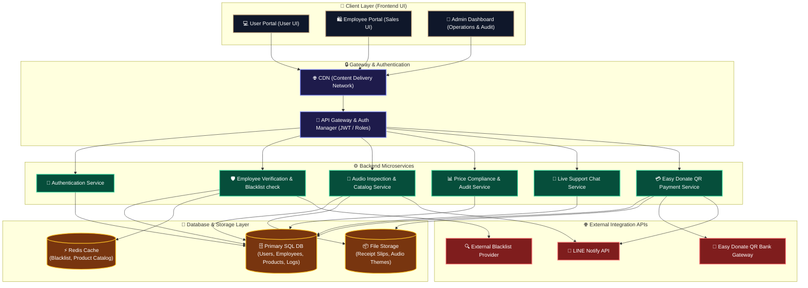
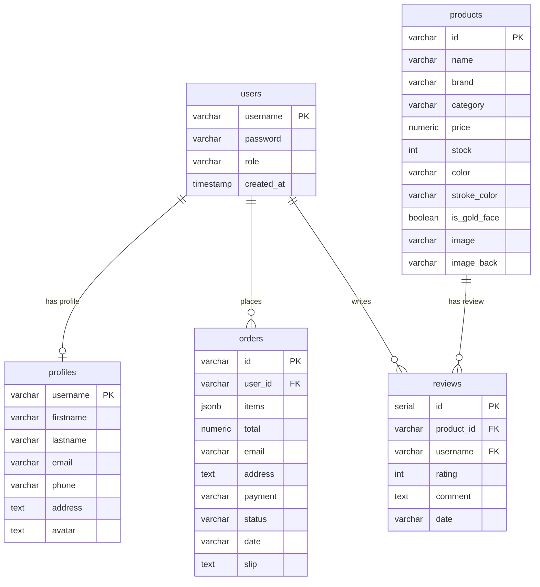
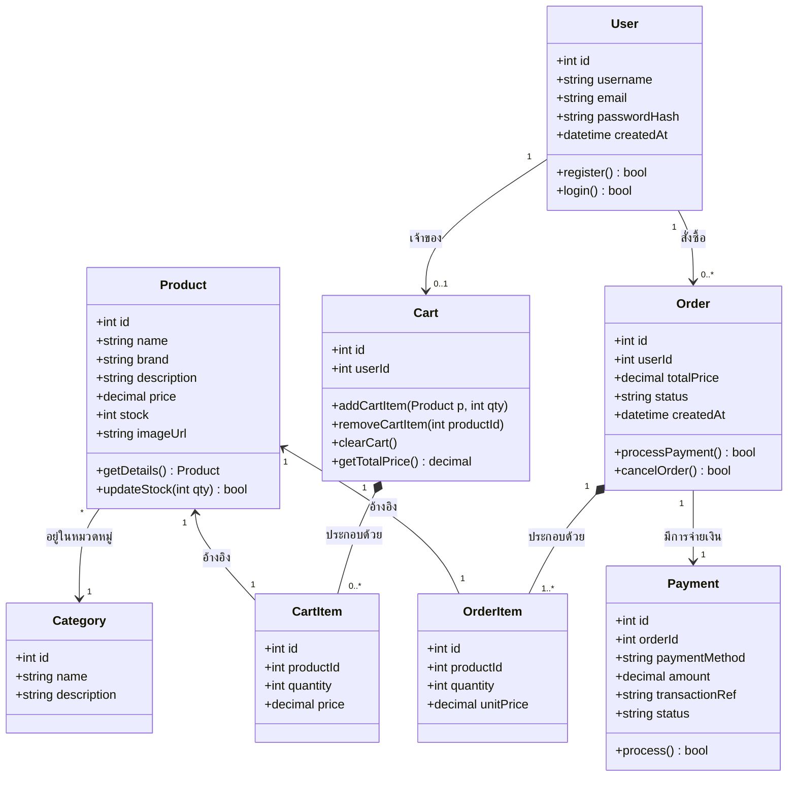
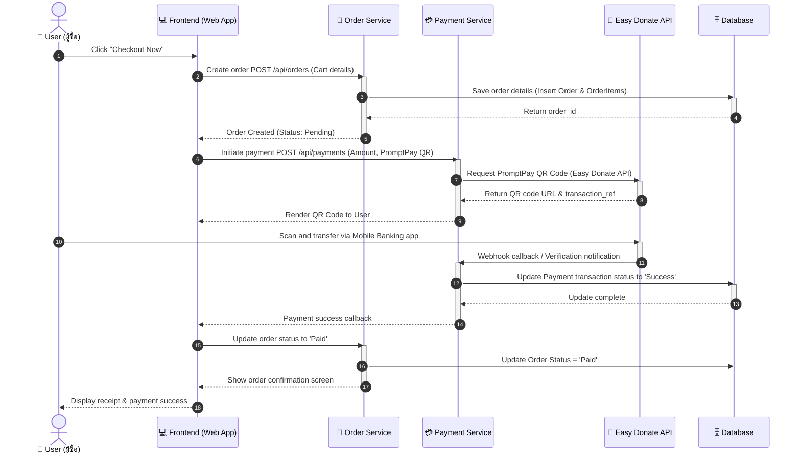
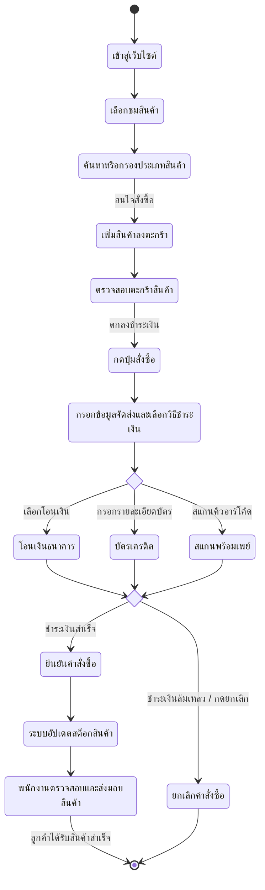
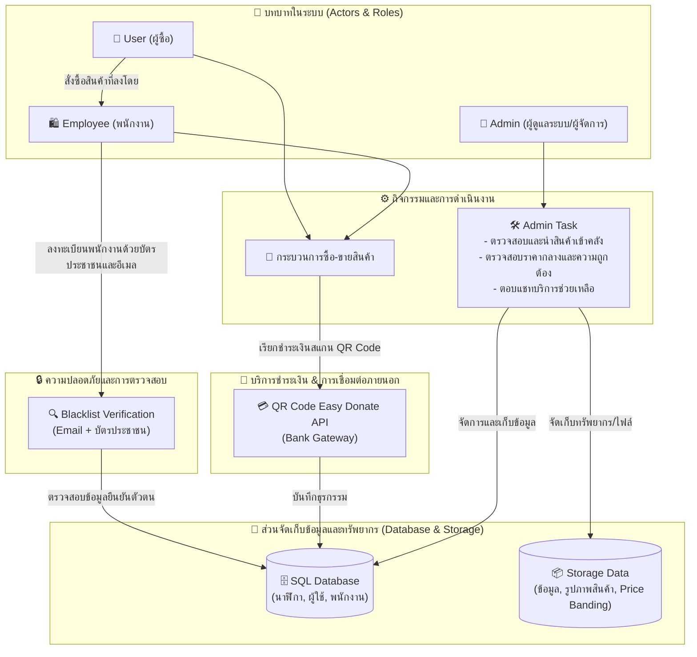
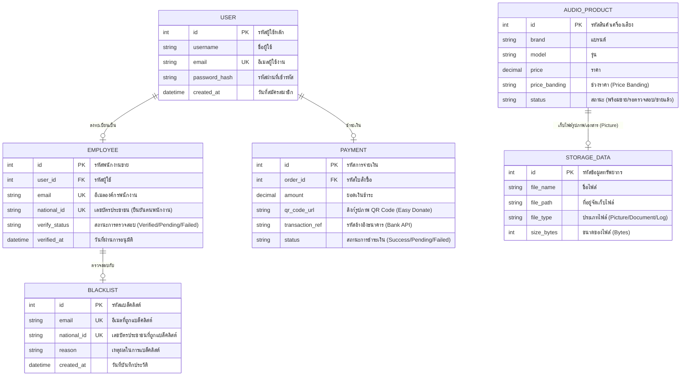

# 📄 เอกสารการวิเคราะห์และออกแบบระบบ (System Analysis & Design)
## โครงการ: AudioMart - แพลตฟอร์มร้านขายเครื่องเสียงและอุปกรณ์เสียงพรีเมียมออนไลน์
**วิชา: CSI204 ดิจิทัลแพลตฟอร์มสำหรับพัฒนาซอฟต์แวร์ (SPU SIT)**
**ผู้จัดทำ:**
1. **กฤษฎา ต้องไกรเลิศ** (รหัสนักศึกษา: 67115444)
2. **ภูกิจ ปัญญาธิ** (รหัสนักศึกษา: 67120169)
3. **นนทิวัชร หมื่นสาย** (รหัสนักศึกษา : 67117362)

---

## 1. การวิเคราะห์ความต้องการของระบบ (System Requirements)
แพลตฟอร์ม **AudioMart** พัฒนาขึ้นเพื่อรองรับพฤติกรรมการซื้อเครื่องเสียง ลำโพง และหูฟังพรีเมียมผ่านทางออนไลน์ โดยระบบแบ่งความต้องการออกเป็น 2 ส่วนหลัก:

### 1.1 ความต้องการเชิงฟังก์ชัน (Functional Requirements)
- **ระบบสำหรับผู้ใช้ทั่วไป (Customer Front-end)**:
  - การลงทะเบียนและเข้าสู่ระบบ (Register / Login)
  - การเลือกชมและค้นหาลำโพง/หูฟังตามประเภท แบรนด์ หรือช่วงราคา (Product Browsing & Filtering)
  - ระบบตะกร้าสินค้า (Shopping Cart) เพิ่ม/ลดจำนวนสินค้า
  - ระบบสั่งซื้อสินค้าและการชำระเงิน (Checkout & Payment Integration)
  - การติดตามสถานะคำสั่งซื้อ (Order Tracking)
- **ระบบแจ้งเตือนภายนอก (Integration Notification)**:
  - แจ้งเตือนยอดคำสั่งซื้อและการชำระเงินผ่าน LINE Notify
- **ระบบสำหรับผู้ดูแลระบบ (Admin Dashboard)**:
  - จัดการข้อมูลเครื่องเสียงและสต็อกสินค้า (CRUD Products)
  - ตรวจสอบรายการคำสั่งซื้อและการจัดการสถานะการจัดส่ง (Order Management)

### 1.2 ความต้องการที่มิใช่เชิงฟังก์ชัน (Non-Functional Requirements)
- **Security**: การรักษาความปลอดภัยข้อมูลผู้ใช้ รหัสผ่านต้องถูกแฮชก่อนบันทึก (เช่น bcrypt) และใช้ Token-based Authentication (JWT)
- **Performance**: โหลดหน้าเว็บได้รวดเร็ว (ต่ำกว่า 2 วินาที) โดยมีระบบ Cache สำหรับข้อมูลรายการสินค้าเครื่องเสียงที่เข้าถึงบ่อย
- **Scalability**: ระบบสถาปัตยกรรมต้องแยกส่วนกัน (Microservices) เพื่อให้รองรับการขยายตัวเมื่อมีผู้ใช้งานพร้อมกันจำนวนมากในอนาคต
- **Responsiveness**: หน้าเว็บแสดงผลได้ดีทั้งบนหน้าจอคอมพิวเตอร์ แท็บเล็ต และมือถือ (Mobile-First Design)

---

## 2. การออกแบบสถาปัตยกรรมระบบ (System Architecture)
ระบบถูกออกแบบโดยยึดตามหลักการ **Separation of Concerns (SoC)** และสถาปัตยกรรม **Microservices** เพื่อการพัฒนาที่ยืดหยุ่นและรองรับปริมาณธุรกรรมที่สูง

### 2.1 แผนผังสถาปัตยกรรมระบบ (Mermaid Diagram)



---

## 3. การออกแบบตามหลักการวิศวกรรมซอฟต์แวร์ (Software Engineering Principles)

### 3.1 Separation of Concerns (SoC) & Modularity
หน้าบ้าน (Frontend) พัฒนาแยกจากหลังบ้าน (Backend) อย่างชัดเจน โดยติดต่อผ่าน RESTful API:
- **Frontend Layer**: ดูแลเฉพาะการจัดแสดงผลอินเทอร์เฟซและการโต้ตอบของผู้ใช้งาน (HTML/CSS/JS)
- **Backend Services**: มีการแบ่งแยกฟังก์ชันการทำงานย่อย (Services) ดังนี้:
  - `User Service`: จัดการข้อมูลผู้ใช้และการพิสูจน์ตัวตน
  - `Product Service`: ดึงข้อมูลเครื่องเสียง ค้นหา และอัปเดตสต็อกสินค้า
  - `Order Service`: จัดการตะกร้าสินค้า สร้างคำสั่งซื้อ และเปลี่ยนสถานะคำสั่งซื้อ

### 3.2 Single Responsibility Principle (SRP)
ทุก Service และทุก Class ถูกออกแบบมาเพื่อทำหน้าที่เพียงอย่างเดียวเท่านั้น เช่น ในโค้ดตัวอย่างหลังบ้าน:
- `user-service/server.js` จัดการเฉพาะ API การล็อกอินและการดึงโปรไฟล์ผู้ใช้
- `product-service/server.js` จัดการเฉพาะข้อมูลสินค้า

### 3.3 Loose Coupling & Flexibility
การเชื่อมต่อระหว่างระบบใช้มาตรฐานการแลกเปลี่ยนข้อมูลเป็น JSON ผ่าน HTTP REST APIs ทำให้แต่ละ Service ทำงานเป็นอิสระต่อกัน (Decoupled) หากเราต้องการเปลี่ยนฐานข้อมูลหรือเปลี่ยนภาษาโปรแกรมของ `Payment Service` ก็สามารถทำได้โดยไม่กระทบกับบริการอื่น

### 3.4 Performance Optimization ด้วย Caching
ข้อมูลประเภทนาฬิกาที่มีการเรียกชมบ่อยครั้ง (เช่น สินค้าขายดี หรือสินค้ารายการใหม่) แต่ไม่ได้เปลี่ยนแปลงบ่อย จะถูกเก็บไว้ใน **Redis Cache** เพื่อลดความถี่ในการ Query ไปยังฐานข้อมูลหลัก ทำให้ระบบสามารถส่งกลับข้อมูลให้ลูกค้าได้เร็วกว่าเดิมถึง 10 เท่า

---

## 4. โครงสร้างฐานข้อมูล (Database Schema Design)
เราเลือกใช้ **PostgreSQL** เป็นฐานข้อมูลหลักสำหรับการทำธุรกรรม เพื่อรักษาเสถียรภาพความถูกต้องของข้อมูล (ACID Properties)

### 4.0 แผนภาพความสัมพันธ์ฐานข้อมูล (ER Diagram)



### 4.1 ตาราง Users
```sql
CREATE TABLE users (
    username VARCHAR(50) PRIMARY KEY,
    password VARCHAR(255) NOT NULL,
    role VARCHAR(20) NOT NULL DEFAULT 'user',
    created_at TIMESTAMP DEFAULT CURRENT_TIMESTAMP
);
```

### 4.2 ตาราง Profiles
```sql
CREATE TABLE profiles (
    username VARCHAR(50) PRIMARY KEY REFERENCES users(username) ON DELETE CASCADE,
    firstname VARCHAR(50),
    lastname VARCHAR(50),
    email VARCHAR(100),
    phone VARCHAR(20),
    address TEXT
);
```

### 4.3 ตาราง Products (รองรับการเก็บคะแนนและรูปภาพสินค้าเครื่องเสียง)
```sql
CREATE TABLE products (
    id VARCHAR(50) PRIMARY KEY,
    name VARCHAR(100) NOT NULL,
    brand VARCHAR(50) NOT NULL,
    category VARCHAR(50) NOT NULL,
    price NUMERIC(12, 2) NOT NULL,
    stock INT NOT NULL DEFAULT 0,
    color VARCHAR(50),
    stroke_color VARCHAR(50),
    is_gold_face BOOLEAN DEFAULT FALSE,
    image VARCHAR(255),
    image_back VARCHAR(255)
);
```

### 4.4 ตาราง Orders (รองรับการจัดเก็บสลิปชำระเงินภายหลังและ 2-Step Verification)
```sql
CREATE TABLE orders (
    id VARCHAR(50) PRIMARY KEY,
    user_id VARCHAR(50) NOT NULL,
    items JSONB NOT NULL,
    total NUMERIC(12, 2) NOT NULL,
    email VARCHAR(100) NOT NULL,
    address TEXT NOT NULL,
    payment VARCHAR(50) NOT NULL,
    status VARCHAR(20) NOT NULL, -- pending_payment, pending_review, manager_approved, confirmed, shipped, cancelled
    date VARCHAR(50) NOT NULL,
    slip TEXT
);
```

### 4.5 ตาราง Reviews
```sql
CREATE TABLE reviews (
    id SERIAL PRIMARY KEY,
    product_id VARCHAR(50) NOT NULL REFERENCES products(id) ON DELETE CASCADE,
    username VARCHAR(50) NOT NULL REFERENCES users(username) ON DELETE CASCADE,
    rating INT NOT NULL CHECK (rating >= 1 AND rating <= 5),
    comment TEXT NOT NULL,
    date VARCHAR(50) NOT NULL
);
```

---

## 5. การวิเคราะห์และออกแบบระบบด้วย UML Diagram (UML Design)
เพื่อแสดงโครงสร้าง ลำดับการทำงาน และความสัมพันธ์ของระบบ **AudioMart** ให้ชัดเจนยิ่งขึ้นตามแนวทางวิศวกรรมซอฟต์แวร์

### 5.1 Use Case Diagram (แผนภาพแสดงการทำงานของผู้ใช้)
แผนภาพ Use Case แสดงขอบเขตของระบบ (System Boundary) และปฏิสัมพันธ์ระหว่างนักช้อป (User), พนักงาน/ผู้จัดการ (Manager) และผู้ดูแลระบบ (Admin)

```mermaid
graph TB
    UserActor["👤 ผู้ซื้อ (User)"]
    ManagerActor["🛍️ ผู้จัดการ (Manager)"]
    AdminActor["👑 ผู้ดูแลระบบ (Admin)"]

    subgraph AudioMart_System ["💼 ระบบ AudioMart Platform"]
        UC_Login["เข้าสู่ระบบ (Login)"]

        subgraph Customer_Actions ["🛒 Customer Use Cases"]
            UC_Search["ค้นหาและกรองเครื่องเสียง (Search & Filter)"]
            UC_Cart["จัดการตะกร้าสินค้า (Manage Cart)"]
            UC_Checkout["สั่งซื้อสินค้า (Checkout)"]
            UC_UploadSlip["แนบสลิปชำระเงินภายหลัง 24 ชม. (Upload Slip)"]
            UC_Track["ติดตามสถานะจัดส่ง (Track Orders)"]
            UC_Notif["รับแจ้งเตือนสถานะ (Notification)"]
        end

        subgraph Manager_Actions ["⚙️ Manager Use Cases"]
            UC_Verify["ยืนยันตัวตนพนักงาน (Employee Verify)"]
            UC_AddAudioProduct["ลงเครื่องเสียงเข้าคลัง (Add Audio Product to Stock)"]
            UC_VerifySlip["ตรวจสอบสลิปและอนุมัติขั้นแรก (Verify Slip)"]
        end

        subgraph Admin_Actions ["👑 Admin Use Cases"]
            UC_Inspect["ตรวจสอบสินค้า (Inspect & Approve)"]
            UC_FinalConfirm["ยืนยันออเดอร์ขั้นสุดท้าย (Final Confirm Order)"]
            UC_PriceAudit["ตรวจสอบราคากลาง (Price Audit)"]
            UC_Chat["ให้บริการแชทช่วยเหลือ (Support Chat)"]
            UC_Blacklist["จัดการบัญชีดำ (Blacklist Management)"]
            UC_Logs["ตรวจสอบระบบประวัติการทำงาน (System Logs)"]
        end
    end

    %% User Connections
    UserActor --> UC_Login
    UserActor --> UC_Search
    UserActor --> UC_Cart
    UserActor --> UC_Checkout
    UserActor --> UC_UploadSlip
    UserActor --> UC_Track
    UserActor --> UC_Notif

    %% Manager Connections
    ManagerActor --> UC_Login
    ManagerActor --> UC_Verify
    ManagerActor --> UC_AddAudioProduct
    ManagerActor --> UC_VerifySlip

    %% Admin Connections
    AdminActor --> UC_Login
    AdminActor --> UC_Inspect
    AdminActor --> UC_FinalConfirm
    AdminActor --> UC_PriceAudit
    AdminActor --> UC_Chat
    AdminActor --> UC_Blacklist
    AdminActor --> UC_Logs

    %% Include relation
    UC_Checkout -.->|"<<include>>"| UC_Login
    UC_AddAudioProduct -.->|"<<include>>"| UC_Verify
```



### 5.2 Class Diagram (แผนภาพคลาสโครงสร้างข้อมูล)
แสดงความสัมพันธ์ของ Object/Entity ต่างๆ ในเชิงโครงสร้างข้อมูลเชิงวัตถุ (Object-Oriented Design) ของระบบ AudioMart



### 5.3 Sequence Diagram (แผนภาพขั้นตอนการทำงาน)
แสดงขั้นตอนการส่งข้อความโต้ตอบระหว่างผู้ใช้ หน้าบ้าน (Frontend) ระบบควบคุมการสั่งซื้อ (Order Service) บริการชำระเงิน (Payment Service) และฐานข้อมูลหลัก เมื่อผู้ใช้ (User) ทำการสั่งซื้อเครื่องเสียงพรีเมียม



### 5.4 Activity Diagram (แผนภาพกิจกรรมการสั่งซื้อสินค้า)
แสดงการไหลของกิจกรรม (Activity Flow) ตั้งแต่เริ่มต้นเลือกชมเครื่องเสียงจนถึงสิ้นสุดการชำระเงินและการส่งมอบสินค้าสำเร็จ



---

## 6. การออกแบบส่วนติดต่อผู้ใช้งาน (UI/UX Design & Wireframe)

### 6.1 แนวคิดการออกแบบ UI/UX (Design Concept)
เพื่อส่งเสริมภาพลักษณ์ความเป็น **Premium Online Sound Systems** ระบบได้รับการวิเคราะห์และออกแบบดังนี้:
* **UI Design (User Interface)**:
  * **Color Palette**: ใช้สีโทนเข้มอาร์กอนกึ่งลักชัวรี (Dark Slate: `#0f172a`, Deep Midnight: `#0b0c10`) ตัดกับสีทองหรูทองคำขาว (Primary Accent Gold: `#c5a880`) เพื่อสะท้อนความประณีตมีระดับ
  * **Typography**: ใช้ฟอนต์ **Outfit** ที่มีหน้าตาเรียบหรู ทันสมัย ดูเป็นสากลและสะอาดตา
  * **Visual**: แสดงรูปภาพสินค้าเครื่องเสียงด้วยกรอบ SVG และ Glassmorphism Overlay (โปร่งแสงแต่อบอุ่นด้วยแสงสะท้อน)
* **UX Design (User Experience)**:
  * **Seamless Checkout**: ลูกค้าสามารถกดเพิ่มสินค้าลงตะกร้าได้อย่างรวดเร็วผ่าน Side Cart Drawer โดยไม่ต้องเปลี่ยนหน้าเว็บบ่อยๆ
  * **Mobile-First Experience**: หน้าหลักและระบบการชำระเงินสามารถใช้งานได้อย่างคล่องตัวบนมือถือ ตอบสนองรวดเร็วผ่านโครงสร้าง Flexbox & Grid CSS

### 6.2 การวางแผนโครงร่างหน้าจอ (Wireframe & Prototype)
ในการพัฒนาออกแบบระบบจะอ้างอิงจากแบบร่างหน้าจอหลัก (Wireframe) 3 หน้า ดังนี้:
1. **Homepage (หน้าหลัก)**:
   * ส่วนบนสุดเป็น Navigation Bar แสดง Logo `AudioMart` และไอคอนตะกร้าสินค้า
   * ส่วนถัดมาคือ Hero Section นำเสนอวิสัยทัศน์ของแบรนด์และปุ่มเรียกให้ดำเนินการ (CTA Button: "เลือกชมสินค้า")
   * ด้านล่างเป็นระบบกรองหมวดหมู่ (Filter Tags) และตารางแสดงรายการสินค้าเครื่องเสียงแบบ Grid
2. **Side Cart Drawer (ตะกร้าสินค้าแบบแถบข้าง)**:
   * สไลด์ออกมาจากทางขวาเมื่อกดรูปตะกร้า
   * แสดงรายการที่เลือกซื้อ ปุ่มปรับเปลี่ยนจำนวน หรือลบชิ้นงาน และสรุปยอดเงินรวม
3. **Checkout UI (หน้าต่างยืนยันสั่งซื้อ)**:
   * ฟอร์มกรอกที่อยู่จัดส่ง และตัวเลือกการชำระเงิน (โอนเงิน, บัตรเครดิต, พร้อมเพย์) พร้อมปุ่มชำระเงินที่เด่นชัด

---

## 7. โครงสร้างระบบและการไหลของข้อมูลใหม่ (New System Structure & Data Flow Design)

เพื่อให้สอดคล้องกับความต้องการเพิ่มเติมเกี่ยวกับสถาปัตยกรรมและกระบวนการทำงานของระบบในการจัดการสินค้า ความปลอดภัย และการชำระเงิน แผนภาพด้านล่างอธิบายถึงความสัมพันธ์และการแลกเปลี่ยนข้อมูลดังนี้:

### 7.1 แผนภาพการไหลของข้อมูลและสถาปัตยกรรม (System Structure & Data Flow)



### 7.2 รายละเอียดการทำงานของระบบใหม่ (System Requirements Specification)
 
1. **บทบาทการดำเนินงานของผู้ใช้งาน (Actors & Operations)**
    - **User (ผู้ซื้อ)**: ทำหน้าที่สั่งซื้อสินค้าจากระบบที่ดำเนินการลงสินค้าโดยพนักงาน (**Employee**)
    - **Employee (พนักงาน/พนักงานขาย)**: สมาชิกที่เป็นพนักงานองค์กรที่มีหน้าที่รับผิดชอบในการนำเครื่องเสียงเข้าระบบคลังสินค้าเพื่อตั้งขาย
    - **Admin (ผู้ดูแลระบบ/ผู้จัดการ)**: รับผิดชอบการบริหารจัดการระบบทั้งหมด ครอบคลุมการตรวจสอบความถูกต้องของสินค้าและราคากลาง (Audit & Inspection), อนุมัติการนำเข้าสินค้า, ตรวจสอบแบล็คลิสต์ และตอบแชทซัพพอร์ตช่วยเหลือลูกค้า
2. **ระบบฐานข้อมูลและพื้นที่จัดเก็บข้อมูล (Database & Storage)**
    - **SQL Database**: จัดเก็บข้อมูลโครงสร้างหลัก ได้แก่ ข้อมูลเครื่องเสียง (AudioProduct), ข้อมูลผู้ใช้งานทั่วไป (User) และข้อมูลพนักงานขาย (Employee)
    - **Storage (Data Store)**: ทำหน้าที่จัดเก็บข้อมูลรูปภาพสินค้า (Picture), โครงสร้างระดับราคา (Price Banding) และไฟล์ข้อมูล (Data) อื่น ๆ ทั้งหมดของระบบ
3. **ระบบตรวจสอบความปลอดภัย (Blacklist & Identity Verification)**
    - ระบบเพิ่มความปลอดภัยขั้นสูงในการลงทะเบียนพนักงาน โดยผู้ที่เป็น **พนักงาน (Employee)** เท่านั้นที่จะต้องยื่นเอกสาร **บัตรประชาชน** และ **Email** เพื่อตรวจสอบความถูกต้องผ่านระบบ Blacklist ก่อนที่จะได้รับอนุญาตให้จัดการและนำเครื่องเสียงเข้าคลังสินค้า
4. **ระบบรับชำระเงิน (QR Code Payment API)**
    - ดำเนินการชำระเงินโดยใช้ **QR Code** ที่ดึงข้อมูลผ่าน API จากธนาคารใดธนาคารหนึ่ง โดยใช้ระบบการรับบริจาค/ชำระเงิน **Easy Donate** เพื่อความปลอดภัยและยืนยันยอดเงินอัตโนมัติ

### 7.3 แผนภาพความสัมพันธ์ฐานข้อมูล (Database ER Diagram)

แผนภาพความสัมพันธ์ระหว่างตารางฐานข้อมูลหลักในระบบ (SQL Database) และส่วนของข้อมูลที่ถูกส่งไปจัดเก็บลงในพื้นที่เก็บข้อมูล (Storage Data) เพื่อให้เห็นประเภทของข้อมูลและความเชื่อมโยง:




